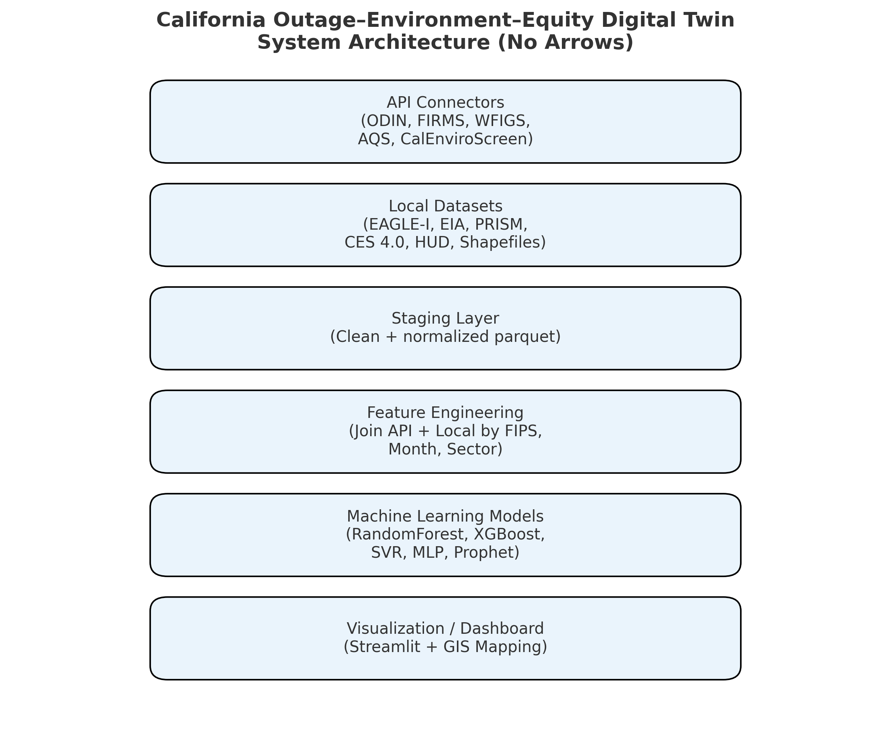

# Architectural Plan for Data Ingestion, Integration, and Machine Learning

**Author:** Vicky Love Franklin, Ph.D.

**Affiliation:** Meharry Medical College, School of Applied Computational Sciences

**Email:** victoria.franklin@mmc.edu

**LinkedIn:** linkedin.com/in/victorialovefranklin

**GitHub:** github.com/victorialovefranklin

**Project Focus:** Resilient Infrastructure, Environmental Intelligence, and Health Equity Modeling

**Overview:** This repository builds a GIS-enabled Digital Twin integrating power-outage, wildfire, weather, air-quality, and social-equity data for predictive resilience analytics across California.
The workflow separates data ingestion, staging, feature engineering, and machine-learning modeling for transparency and reproducibility. 

---

 

# Pipeline Modules

| **Module**               | **Purpose**                                                           | **Key Tasks**                                     | **Outputs**                                |
| ------------------------ | --------------------------------------------------------------------- | ------------------------------------------------- | ------------------------------------------ |
| `ingest_local.py`        | Load and standardize static CSV/shapefile data                        | Read EAGLE-I, EIA, PRISM, CES 4.0 etc.            | `/staging/*.parquet`                       |
| `ingest_api.py`          | Fetch live data from ODIN, FIRMS, WFIGS, AQS and CalEnviroScreen APIs | Timestamped pulls → normalized format             | `/data_api_raw/` + `/staging/*.parquet`    |
| `staging_to_features.py` | Merge API + local data into monthly state/county feature tables       | Derive `year`, `month`, `fips`; aggregate metrics | `/features/state_monthly_features.parquet` |
| `train_models.py`        | Compare ML algorithms for outage prediction                           | Train RF, XGB, SVR, MLP with cross-validation     | `/models/model_results_state.csv`          |

# Modeling Design
| **Goal**                                               | **Approach**                          |
| ------------------------------------------------------ | ------------------------------------- |
| Predict outage magnitude / duration                    | Regression (RandomForest, XGBoost)    |
| Classify outage cause (weather vs policy vs equipment) | Multiclass classification             |
| Interpret feature importance                           | SHAP + Permutation Importance         |
| Forecast resilience scenarios                          | Prophet / ARIMA time-series extension |

# Target Variables:
outage_count, customer_weighted_hours, event_duration
**Feature Families:**
- Meteorological (NOAA, PRISM)
- Wildfire (CAL FIRE, FIRMS, POST-FIRE)
- Air Quality (EPA AQS)
- Socio-economic (CES 4.0, HUD)
- Policy (PSPS, Planned vs Unplanned)

# Data Refresh Cadence
| **Source**          | **Update Cycle**  | **Method**           |
| ------------------- | ----------------- | -------------------- |
| ODIN Outages        | Daily             | API pull             |
| WFIGS Incidents     | Daily             | ArcGIS REST → CSV    |
| NASA FIRMS          | Daily             | Area API (BBOX CA)   |
| EPA AQS             | Weekly            | API (batch state=06) |
| NOAA Storm Events   | Quarterly         | FTP download         |
| EAGLE-I / EIA-861   | Annual            | Local CSV refresh    |
| CalEnviroScreen 4.0 | Static / Periodic | CSV + ArcGIS API     |

# Development Conventions
- Language: Python 3.12+
- Core Libraries: pandas, geopandas, requests, scikit-learn, xgboost, prophet
- Visualization: matplotlib, plotly, streamlit, leafmap
- Data Formats: CSV ↔ Parquet ↔ GeoJSON ↔ Shapefile
- Version Control: Git LFS for large data assets (>50 MB)
- Environment: .env with API keys (AQS_API_KEY, AQS_EMAIL, FIRMS_MAP_KEY)

# Machine-Learning Outputs
| **Output Artifact**              | **Contents**                 | **Example Use**             |
| -------------------------------- | ---------------------------- | --------------------------- |
| `model_results_state.csv`        | RMSE, MAE, R² for each model | Model comparison table      |
| `feature_importance_RF.csv`      | SHAP values + ranking        | Interpretability plots      |
| `forecast_outage_trends.csv`     | 12-month forecasts           | Dashboard integration       |
| `state_monthly_features.parquet` | Unified feature set          | Reproducible training input |

# Digital Twin Architecture Plan (Two Horizons: Short-Term + Long-Term)

| Layer / Module                    | Purpose                             | Key Inputs                                                                                                                             | Core Process / Methods                                                                  | Outputs & Artifacts                                         | Update Cadence                       | Metrics (QoS + Model)                                       | Owner / Role        | Notes                                        |
| --------------------------------- | ----------------------------------- | -------------------------------------------------------------------------------------------------------------------------------------- | --------------------------------------------------------------------------------------- | ----------------------------------------------------------- | ------------------------------------ | ----------------------------------------------------------- | ------------------- | -------------------------------------------- |
| **Data Ingestion (ETL)**          | Pull raw data reliably              | EAGLE-I outages, NOAA/NWS weather & alerts, fire danger/fuel moisture, PSPS, EIA-861, census/SDOH, CalEnviroScreen, grids & shapefiles | Batch + streaming pipelines; schema enforcement; late-arriving data handling            | `/data/raw/*` parquet/csv + ingestion logs                  | Hourly (ops); Monthly (planning)     | Pipeline success %, latency, data completeness              | Data Eng            | Use data contracts; version schemas          |
| **Data Quality (DQ)**             | Validate & cleanse                  | Raw feeds from ETL                                                                                                                     | Null/dup checks, range rules, spatial/temporal joins, de-biasing, outlier flags         | DQ reports; curated `/data/clean/*`                         | With each ingest                     | % valid rows, rule pass rate, anomaly counts                | Data Eng + QA       | Store DQ results for audits                  |
| **Feature Store (Shared)**        | Single source of truth for features | Cleaned datasets; geospatial joins                                                                                                     | Windowed features (lags, rolling stats), weather lead vars, vegetation, equity indices  | `/features/{granularity}/{horizon}.parquet`                 | Hourly/daily (short), Monthly (long) | Feature freshness, drift (PSI), coverage                    | MLOps               | Keep identical feature names across horizons |
| **Short-Term Modeling (Ops)**     | 1–30 day outage risk & impact       | High-freq weather/alerts, recent outages, load                                                                                         | Baselines (ARIMA/Prophet), XGBoost; binary risk & regression (cust. affected, duration) | Model registry, `predictions_daily.parquet`, SHAP summaries | Daily (or hourly before events)      | RMSE/MAE, AUPRC/Brier, alert precision/recall, latency      | Data Sci (Ops)      | Keep one primary model in v1                 |
| **Long-Term Modeling (Strategy)** | 1–10+ year resilience outlook       | Monthly/annual aggregates, policy & infra covariates, climate scenarios                                                                | XGBoost/RF + scenario generator (P10/P50/P90), Monte Carlo sensitivity                  | `projections_annual.parquet`, scenario plots, model cards   | Quarterly refresh                    | RMSE/MAE/R² (time-blocked CV), scenario spread, sensitivity | Data Sci (Strategy) | Tie to investment planning                   |
| **Simulation & What-If (DT)**     | Interventions + policy testing      | Models + configurable levers (vegetation, AMI, hardening)                                                                              | Parametric sims; counterfactuals; cost-benefit                                          | `sim_runs/*.parquet`, dashboards, CBA tables                | On demand                            | Benefit-cost ratio, avoided outage-hours, equity lift       | Analytics Eng       | Keep levers simple in v1                     |
| **Geospatial Services**           | Spatialize risk & exposure          | Features + tract/county shapes                                                                                                         | Tiling, hotspot (Getis-Ord), cluster/regression maps                                    | Vector tiles, geojson layers, map services                  | With predictions                     | Tile build time, map response time                          | GIS Eng             | Pre-compute heavy tiles                      |
| **Dashboards (Ops)**              | Live situational awareness          | Short-term preds, alerts, DQ status                                                                                                    | Ops UI (risk next 7 days), SHAP top drivers, alerting rules                             | Web app; PDF daily brief                                    | Daily                                | Uptime, alert lead time, user actions                       | Prod Eng + Ops      | Keep <3 key charts                           |
| **Dashboards (Strategy)**         | Planning & equity view              | Long-term projections, scenarios                                                                                                       | Trend panels, scenario toggles, tract equity overlay                                    | Web app; quarterly planning brief                           | Quarterly                            | Decision adoption, ROI of actions                           | Prod Eng + Planning | Link to budget planner                       |
| **Alerting & Workflow**           | Turn risk into action               | Short-term risk, thresholds                                                                                                            | Rules engine; pagers/email; ticket creation                                             | Incident tickets; alert logs                                | Near-real time                       | False-alarm rate, time-to-ack                               | Ops                 | Start with simple thresholds                 |
| **MLOps & Governance**            | Repro, audit, safety                | Code, data, models, lineage                                                                                                            | Model registry, CI/CD, data lineage, model cards                                        | Versioned artifacts; audit trails                           | Continuous                           | Drift/PSI, rollback time, test coverage                     | MLOps               | Enforce approvals for prod                   |
| **Security & Compliance**         | Protect data & access               | All components                                                                                                                         | IAM, secrets vault, encryption, logging                                                 | Access policies; KMS keys                                   | Continuous                           | Policy violations, key rotation                             | SecOps              | Least privilege; rotate creds                |
| **Documentation & RACI**          | Shared understanding                | All teams                                                                                                                              | READMEs, SOPs, RACI, runbooks                                                           | `/docs/*` + wiki                                            | Continuous                           | Doc freshness, on-call success                              | PMO                 | Update with each release                     |

# Deployment Vision
- Streamlit Dashboard: interactive maps + ML summaries
- GitHub Actions: automated daily API refresh and model retrain
- Data Export: County / State GeoJSON for public web visualizations
