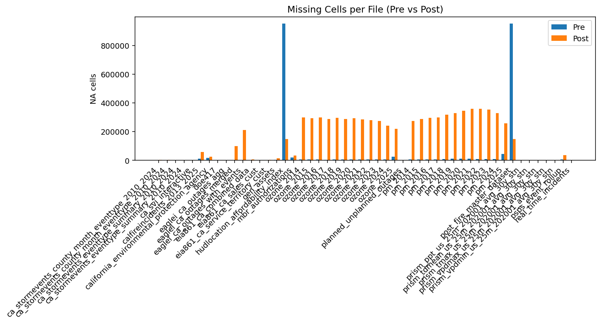

# Toward Climate-Resilient Energy Systems: A Geospatial RAG-Enabled Digital Twin for Equity and Ecosystem Sustainability 
**Report submitted to Meharry Medical College**
of **DoE/SRNL Report** by
**Victoria Love Franklin** Ph.D. Data Science Pre-Candidate, Meharry Medical College under the guidance of Dr. Lei Qian
(Department of Computer Science and Data Science)

## Data Cleaning & Imputation Report

This report summarizes pre/post cleaning stats and imputation actions for all files.

# Author

**Contact:** victoria.franklin@mmc.edu

**LinkedIn:** https://www.linkedin.com/in/victorialovefranklin/ 

**GitHub:** https://github.com/officialvickylove](https://github.com/victorialovefranklin

**ORCID:** 0009-0004-8883-767X

**Institution:** Meharry Medical College, School of Applied Computational Sciences, Department of Computer Science and Data Science

 ---

## Per-file Summary

| file                                            |   rows_pre |   cols_pre |   rows_post |   cols_post |   dupes_pre |   dupes_post |   na_cells_pre |   na_cells_post |   imputed_cells |
|:------------------------------------------------|-----------:|-----------:|------------:|------------:|------------:|-------------:|---------------:|----------------:|----------------:|
| ca_stormevents_county_month_eventtype_2010_2024 |       3243 |          6 |        2978 |           7 |           0 |            0 |              0 |            2978 |               0 |
| ca_stormevents_county_month_eventtype_2010_2024 |       3243 |          6 |        2978 |           7 |           0 |            0 |              0 |            2978 |               0 |
| ca_stormevents_eventtype_summary_2010_2024      |         12 |          2 |          11 |           2 |           0 |            0 |              0 |              11 |               0 |
| ca_stormevents_eventtype_summary_2010_2024      |         12 |          2 |          11 |           2 |           0 |            0 |              0 |              11 |               0 |
| calepaoehha                                     |       8035 |        113 |        8035 |         114 |           0 |            0 |          17311 |           24105 |            3551 |
| calfireincidents_2013_2025                      |       3356 |         23 |        3354 |          23 |           0 |            0 |          11176 |           57018 |             104 |
| california_county                               |         58 |        158 |          58 |         158 |           0 |            0 |              0 |             116 |               0 |
| california_environmental_protection_agency      |       8035 |        113 |        8035 |         114 |           0 |            0 |          17311 |           24105 |            3551 |
| doe417                                          |         27 |         11 |           6 |          11 |           0 |            0 |             61 |              54 |               3 |
| eaglei_ca_outages_agg                           |        130 |          6 |         130 |           7 |           0 |            0 |              0 |              10 |               0 |
| eaglei_ca_outages_merged                        |      98104 |          8 |       98104 |          11 |           0 |            0 |              0 |           98104 |               0 |
| eaglei_ca_outages_with_events                   |      61499 |         14 |       30120 |          17 |       20284 |            0 |              0 |          210840 |               0 |
| eia861_ca_combined_data                         |       2452 |         11 |        2452 |          11 |           0 |            0 |              0 |            4904 |             915 |
| eia861_ca_sales_cust                            |       1355 |          9 |        1320 |           9 |           6 |            0 |              0 |            1320 |             927 |
| eia861_ca_service_territory_cust                |       1861 |          5 |        1861 |           5 |           0 |            0 |              0 |            1861 |               0 |
| gen_assets                                      |       2435 |         11 |        2435 |          11 |           0 |            0 |           2435 |           14610 |               0 |
| hudlocation_affordability_index                 |      73763 |        444 |       73763 |         445 |           0 |            0 |         952276 |          147526 |          950709 |
| mbr_authorizations                              |       4204 |         14 |        4204 |          14 |           0 |            0 |          18554 |           33632 |           15630 |
| ozone_2014                                      |      59644 |         21 |       59644 |          24 |           0 |            0 |           4608 |          298220 |            2304 |
| ozone_2015                                      |      58540 |         21 |       58540 |          24 |           0 |            0 |           4634 |          292700 |            2317 |
| ozone_2016                                      |      59853 |         21 |       59853 |          24 |           0 |            0 |           4592 |          299265 |            2296 |
| ozone_2017                                      |      57575 |         21 |       57575 |          24 |           0 |            0 |           4120 |          287875 |            2060 |
| ozone_2018                                      |      58972 |         21 |       58972 |          24 |           0 |            0 |           4526 |          294860 |            2263 |
| ozone_2019                                      |      57729 |         21 |       57729 |          24 |           0 |            0 |           4568 |          288645 |            2284 |
| ozone_2020                                      |      58741 |         21 |       58741 |          24 |           0 |            0 |           4712 |          293705 |            2356 |
| ozone_2021                                      |      56942 |         21 |       56942 |          24 |           0 |            0 |           4608 |          284710 |            2304 |
| ozone_2022                                      |      55576 |         21 |       55576 |          24 |           0 |            0 |           4590 |          277880 |            2295 |
| ozone_2023                                      |      54597 |         21 |       54597 |          24 |           0 |            0 |           4436 |          272985 |            2218 |
| ozone_2024                                      |      48241 |         21 |       48241 |          24 |           0 |            0 |           4434 |          241205 |            2217 |
| ozone_2025                                      |      43696 |         21 |       43696 |          24 |           0 |            0 |          24927 |          218480 |           22982 |
| planned_unplanned_outages                       |         79 |         15 |          79 |          16 |           0 |            0 |            107 |             711 |              13 |
| pm_2014                                         |      45430 |         22 |       45430 |          25 |           0 |            0 |           5516 |          272580 |            2733 |
| pm_2015                                         |      47889 |         22 |       47889 |          25 |           0 |            0 |           5267 |          287334 |            2618 |
| pm_2016                                         |      49500 |         22 |       49500 |          25 |           0 |            0 |           6112 |          297000 |            3044 |
| pm_2017                                         |      49666 |         22 |       49666 |          25 |           0 |            0 |           5738 |          297996 |            2869 |
| pm_2018                                         |      52833 |         22 |       52833 |          25 |           0 |            0 |           7938 |          316998 |            3969 |
| pm_2019                                         |      54858 |         22 |       54858 |          25 |           0 |            0 |           9754 |          329148 |            4877 |
| pm_2020                                         |      57510 |         22 |       57510 |          25 |           0 |            0 |          10408 |          345060 |            5204 |
| pm_2021                                         |      59768 |         22 |       59768 |          25 |           0 |            0 |          10010 |          358608 |            5005 |
| pm_2022                                         |      59918 |         22 |       59918 |          25 |           0 |            0 |           9138 |          359508 |            4569 |
| pm_2023                                         |      58915 |         22 |       58915 |          25 |           0 |            0 |           9103 |          353490 |            4508 |
| pm_2024                                         |      54611 |         22 |       54611 |          25 |           0 |            0 |           9141 |          327666 |            4390 |
| pm_2025                                         |      42783 |         22 |       42783 |          25 |           0 |            0 |          43173 |          256698 |           21441 |
| post_fire_master_dataset                        |      73763 |        444 |       73763 |         445 |           0 |            0 |         952276 |          147526 |          950709 |
| prism_ppt_us_25m_202001_avg_30y_stn             |      20630 |          1 |       20630 |           1 |           0 |            1 |              0 |               0 |               1 |
| prism_tdmean_us_25m_202001_avg_30y_stn          |       6152 |          1 |        6152 |           1 |           0 |            1 |              0 |               0 |               1 |
| prism_tmax_us_25m_202001_avg_30y_stn            |      19367 |          1 |       19367 |           1 |           0 |            0 |              0 |               0 |               1 |
| prism_vpdmax_us_25m_202001_avg_30y_stn          |       6076 |          1 |        6076 |           1 |           0 |            1 |              0 |               0 |               1 |
| prism_vpdmin_us_25m_202001_avg_30y_stn          |       6076 |          1 |        6076 |           1 |           0 |            1 |              0 |               0 |               1 |
| psps_event_rollup                               |       7197 |         13 |        6930 |          13 |         114 |          237 |           4341 |           34650 |           10300 |
| real_time_incidents                             |         69 |         20 |          69 |          23 |           0 |            0 |            216 |            1035 |               0 |
| _ALL_                                           |    1715020 |       1969 |     1682784 |        2058 |       20404 |          241 |        2182117 |         7960721 |         2049540 |

---

## Missingness by Column (pre vs post)

Top 5 columns with highest missingness per file (pre):

| file                                            | column                                                                                                                                    |   missing_% |
|:------------------------------------------------|:------------------------------------------------------------------------------------------------------------------------------------------|------------:|
| real_time_incidents                             | customersRestored                                                                                                                         |      100    |
| real_time_incidents                             | statusKind                                                                                                                                |      100    |
| calepaoehha                                     | Tract_1                                                                                                                                   |      100    |
| real_time_incidents                             | utilityDisclaimer                                                                                                                         |      100    |
| planned_unplanned_outages                       | OutageStatusColor                                                                                                                         |      100    |
| calfireincidents_2013_2025                      | incident_administrative_unit_url                                                                                                          |      100    |
| california_environmental_protection_agency      | Tract_1                                                                                                                                   |      100    |
| doe417                                          | Time Event Began                                                                                                                          |      100    |
| gen_assets                                      | Inactive_Date                                                                                                                             |      100    |
| calfireincidents_2013_2025                      | incident_control                                                                                                                          |       96.48 |
| hudlocation_affordability_index                 | avg_hh_vmt                                                                                                                                |       95.88 |
| post_fire_master_dataset                        | avg_hh_vmt                                                                                                                                |       95.88 |
| hudlocation_affordability_index                 | avg_vmt                                                                                                                                   |       95.84 |
| hudlocation_affordability_index                 | std_dev_vmt                                                                                                                               |       95.84 |
| post_fire_master_dataset                        | avg_vmt                                                                                                                                   |       95.84 |
| post_fire_master_dataset                        | std_dev_vmt                                                                                                                               |       95.84 |
| post_fire_master_dataset                        | veh_count                                                                                                                                 |       95.84 |
| hudlocation_affordability_index                 | veh_count                                                                                                                                 |       95.84 |
| mbr_authorizations                              | Cancellation_Effective_Date                                                                                                               |       92.7  |
| mbr_authorizations                              | Cancellation_Docket_Number                                                                                                                |       92.67 |
| mbr_authorizations                              | Reference_ID                                                                                                                              |       85.92 |
| mbr_authorizations                              | Updated_Record_ID                                                                                                                         |       85.92 |
| mbr_authorizations                              | Inactive_Date                                                                                                                             |       84.13 |
| doe417                                          | Time of Restoration                                                                                                                       |       74.07 |
| california_environmental_protection_agency      | DAC_category                                                                                                                              |       71.25 |
| calepaoehha                                     | DAC_category                                                                                                                              |       71.25 |
| calfireincidents_2013_2025                      | incident_cooperating_agencies                                                                                                             |       49.55 |
| ozone_2025                                      | Method Code                                                                                                                               |       48.14 |
| pm_2025                                         | Method Description                                                                                                                        |       43.4  |
| pm_2025                                         | Method Code                                                                                                                               |       43.4  |
| calfireincidents_2013_2025                      | incident_type                                                                                                                             |       36.77 |
| planned_unplanned_outages                       | Cause                                                                                                                                     |       34.18 |
| doe417                                          | Date of Restoration                                                                                                                       |       25.93 |
| calfireincidents_2013_2025                      | incident_dateonly_extinguished                                                                                                            |       22.44 |
| psps_event_rollup                               | OTHER CUSTOMERS                                                                                                                           |       19.09 |
| doe417                                          | Demand Loss (MW)                                                                                                                          |       11.11 |
| psps_event_rollup                               | MEDICAL BASELINE CUSTOMERS                                                                                                                |        9.85 |
| psps_event_rollup                               | RESIDENTIAL CUSTOMERS                                                                                                                     |        9.38 |
| pm_2020                                         | CBSA Name                                                                                                                                 |        9.05 |
| pm_2020                                         | CBSA Code                                                                                                                                 |        9.05 |
| pm_2019                                         | CBSA Code                                                                                                                                 |        8.89 |
| pm_2019                                         | CBSA Name                                                                                                                                 |        8.89 |
| psps_event_rollup                               | COMMERCIAL/INDUSTRIAL CUSTOMERS                                                                                                           |        8.66 |
| pm_2021                                         | CBSA Name                                                                                                                                 |        8.37 |
| pm_2021                                         | CBSA Code                                                                                                                                 |        8.37 |
| psps_event_rollup                               | TOTAL CUSTOMERS IMPACTED                                                                                                                  |        8.17 |
| pm_2024                                         | CBSA Code                                                                                                                                 |        8.04 |
| pm_2024                                         | CBSA Name                                                                                                                                 |        8.04 |
| pm_2023                                         | CBSA Name                                                                                                                                 |        7.65 |
| pm_2023                                         | CBSA Code                                                                                                                                 |        7.65 |
| pm_2022                                         | CBSA Code                                                                                                                                 |        7.63 |
| pm_2022                                         | CBSA Name                                                                                                                                 |        7.63 |
| pm_2018                                         | CBSA Code                                                                                                                                 |        7.51 |
| pm_2018                                         | CBSA Name                                                                                                                                 |        7.51 |
| doe417                                          | Total_CustomersAffected                                                                                                                   |        7.41 |
| real_time_incidents                             | causeKind                                                                                                                                 |        7.25 |
| pm_2025                                         | CBSA Code                                                                                                                                 |        6.72 |
| pm_2025                                         | CBSA Name                                                                                                                                 |        6.72 |
| pm_2016                                         | CBSA Code                                                                                                                                 |        6.15 |
| pm_2016                                         | CBSA Name                                                                                                                                 |        6.15 |
| pm_2014                                         | CBSA Code                                                                                                                                 |        6.02 |
| pm_2014                                         | CBSA Name                                                                                                                                 |        6.02 |
| real_time_incidents                             | EstimatedRestorationTime                                                                                                                  |        5.8  |
| pm_2017                                         | CBSA Name                                                                                                                                 |        5.78 |
| pm_2017                                         | CBSA Code                                                                                                                                 |        5.78 |
| pm_2015                                         | CBSA Name                                                                                                                                 |        5.47 |
| pm_2015                                         | CBSA Code                                                                                                                                 |        5.47 |
| hudlocation_affordability_index                 | avg_h_cost                                                                                                                                |        5.19 |
| post_fire_master_dataset                        | avg_h_cost                                                                                                                                |        5.19 |
| ozone_2024                                      | CBSA Name                                                                                                                                 |        4.6  |
| ozone_2024                                      | CBSA Code                                                                                                                                 |        4.6  |
| ozone_2025                                      | CBSA Code                                                                                                                                 |        4.45 |
| ozone_2025                                      | CBSA Name                                                                                                                                 |        4.45 |
| california_environmental_protection_agency      | Unemploy_Pctl                                                                                                                             |        4.17 |
| calepaoehha                                     | Unemployment                                                                                                                              |        4.17 |
| calepaoehha                                     | Unemploy_Pctl                                                                                                                             |        4.17 |
| california_environmental_protection_agency      | Unemployment                                                                                                                              |        4.17 |
| ozone_2022                                      | CBSA Code                                                                                                                                 |        4.13 |
| ozone_2022                                      | CBSA Name                                                                                                                                 |        4.13 |
| ozone_2023                                      | CBSA Code                                                                                                                                 |        4.06 |
| ozone_2023                                      | CBSA Name                                                                                                                                 |        4.06 |
| ozone_2021                                      | CBSA Name                                                                                                                                 |        4.05 |
| ozone_2021                                      | CBSA Code                                                                                                                                 |        4.05 |
| ozone_2020                                      | CBSA Name                                                                                                                                 |        4.01 |
| ozone_2020                                      | CBSA Code                                                                                                                                 |        4.01 |
| calepaoehha                                     | Ling_Isol                                                                                                                                 |        3.98 |
| california_environmental_protection_agency      | Ling_Isol                                                                                                                                 |        3.98 |
| ozone_2019                                      | CBSA Code                                                                                                                                 |        3.96 |
| ozone_2015                                      | CBSA Name                                                                                                                                 |        3.96 |
| ozone_2019                                      | CBSA Name                                                                                                                                 |        3.96 |
| ozone_2015                                      | CBSA Code                                                                                                                                 |        3.96 |
| ozone_2014                                      | CBSA Code                                                                                                                                 |        3.86 |
| ozone_2014                                      | CBSA Name                                                                                                                                 |        3.86 |
| ozone_2018                                      | CBSA Name                                                                                                                                 |        3.84 |
| ozone_2018                                      | CBSA Code                                                                                                                                 |        3.84 |
| ozone_2016                                      | CBSA Code                                                                                                                                 |        3.84 |
| ozone_2016                                      | CBSA Name                                                                                                                                 |        3.84 |
| ozone_2017                                      | CBSA Code                                                                                                                                 |        3.58 |
| ozone_2017                                      | CBSA Name                                                                                                                                 |        3.58 |
| planned_unplanned_outages                       | Estimated Restoration Date/Time                                                                                                           |        1.27 |
| pm_2025                                         | Local Site Name                                                                                                                           |        0.68 |
| pm_2024                                         | Local Site Name                                                                                                                           |        0.66 |
| pm_2023                                         | Local Site Name                                                                                                                           |        0.15 |
| pm_2014                                         | Local Site Name                                                                                                                           |        0.11 |
| pm_2015                                         | Local Site Name                                                                                                                           |        0.06 |
| pm_2016                                         | Local Site Name                                                                                                                           |        0.05 |
| eaglei_ca_outages_with_events                   | state                                                                                                                                     |        0    |
| eaglei_ca_outages_with_events                   | county                                                                                                                                    |        0    |
| eaglei_ca_outages_with_events                   | start_time                                                                                                                                |        0    |
| eia861_ca_combined_data                         | Year                                                                                                                                      |        0    |
| eia861_ca_sales_cust                            | Commercial_Customer_Count                                                                                                                 |        0    |
| eia861_ca_sales_cust                            | Industrial_Customer_Count                                                                                                                 |        0    |
| eia861_ca_sales_cust                            | Transportation_Customer_Count                                                                                                             |        0    |
| eia861_ca_sales_cust                            | Total_Customer_ Count                                                                                                                     |        0    |
| eia861_ca_service_territory_cust                | Year                                                                                                                                      |        0    |
| eaglei_ca_outages_merged                        | fips                                                                                                                                      |        0    |
| eaglei_ca_outages_agg                           | customer_weighted_hours                                                                                                                   |        0    |
| eaglei_ca_outages_agg                           | max_outage_duration                                                                                                                       |        0    |
| eaglei_ca_outages_agg                           | outage_count                                                                                                                              |        0    |
| eaglei_ca_outages_agg                           | month                                                                                                                                     |        0    |
| eaglei_ca_outages_agg                           | year                                                                                                                                      |        0    |
| eia861_ca_service_territory_cust                | County                                                                                                                                    |        0    |
| eia861_ca_service_territory_cust                | State                                                                                                                                     |        0    |
| eia861_ca_service_territory_cust                | Utility_Name                                                                                                                              |        0    |
| eia861_ca_service_territory_cust                | Utility_Number                                                                                                                            |        0    |
| eia861_ca_combined_data                         | Utility_Name_x                                                                                                                            |        0    |
| eaglei_ca_outages_with_events                   | max_customers                                                                                                                             |        0    |
| gen_assets                                      | Gen_Code                                                                                                                                  |        0    |
| gen_assets                                      | ID                                                                                                                                        |        0    |
| gen_assets                                      | Gen_Name                                                                                                                                  |        0    |
| gen_assets                                      | State                                                                                                                                     |        0    |
| eia861_ca_combined_data                         | Utility_Number                                                                                                                            |        0    |
| eaglei_ca_outages_merged                        | county                                                                                                                                    |        0    |
| eaglei_ca_outages_merged                        | start_time                                                                                                                                |        0    |
| eaglei_ca_outages_merged                        | duration                                                                                                                                  |        0    |
| eaglei_ca_outages_merged                        | min_customers                                                                                                                             |        0    |
| eaglei_ca_outages_with_events                   | event_id                                                                                                                                  |        0    |
| california_county                               | M_HISP                                                                                                                                    |        0    |
| california_county                               | E_ASIAN                                                                                                                                   |        0    |
| california_county                               | M_ASIAN                                                                                                                                   |        0    |
| california_county                               | E_AIAN                                                                                                                                    |        0    |
| california_county                               | M_AIAN                                                                                                                                    |        0    |
| eia861_ca_combined_data                         | State                                                                                                                                     |        0    |
| eia861_ca_combined_data                         | Residential_Customer_Count                                                                                                                |        0    |
| eia861_ca_sales_cust                            | Year                                                                                                                                      |        0    |
| ozone_2014                                      | Percent Complete                                                                                                                          |        0    |
| ozone_2014                                      | AQS Parameter Code                                                                                                                        |        0    |
| ozone_2014                                      | Local Site Name                                                                                                                           |        0    |
| ozone_2015                                      | Site ID                                                                                                                                   |        0    |
| ozone_2015                                      | Source                                                                                                                                    |        0    |
| ozone_2015                                      | Date                                                                                                                                      |        0    |
| planned_unplanned_outages                       | OBJECTID                                                                                                                                  |        0    |
| planned_unplanned_outages                       | County                                                                                                                                    |        0    |
| ozone_2016                                      | Site ID                                                                                                                                   |        0    |
| ca_stormevents_county_month_eventtype_2010_2024 | events_n                                                                                                                                  |        0    |
| ca_stormevents_county_month_eventtype_2010_2024 | prop_damage_usd                                                                                                                           |        0    |
| ca_stormevents_county_month_eventtype_2010_2024 | crop_damage_usd                                                                                                                           |        0    |
| ca_stormevents_eventtype_summary_2010_2024      | EVENT_TYPE                                                                                                                                |        0    |
| ca_stormevents_county_month_eventtype_2010_2024 | county                                                                                                                                    |        0    |
| ca_stormevents_county_month_eventtype_2010_2024 | month                                                                                                                                     |        0    |
| prism_tmax_us_25m_202001_avg_30y_stn            | This file contains a list of stations that provided input data to the PRISM run that produced the grid associated with this stn.csv file. |        0    |
| prism_vpdmax_us_25m_202001_avg_30y_stn          | This file contains a list of stations that provided input data to the PRISM run that produced the grid associated with this stn.csv file. |        0    |
| prism_vpdmin_us_25m_202001_avg_30y_stn          | This file contains a list of stations that provided input data to the PRISM run that produced the grid associated with this stn.csv file. |        0    |
| ozone_2021                                      | County FIPS Code                                                                                                                          |        0    |
| ozone_2021                                      | County                                                                                                                                    |        0    |
| ozone_2021                                      | Site Latitude                                                                                                                             |        0    |
| ozone_2022                                      | Site ID                                                                                                                                   |        0    |
| ozone_2022                                      | Source                                                                                                                                    |        0    |
| ozone_2022                                      | Date                                                                                                                                      |        0    |
| ozone_2023                                      | Site ID                                                                                                                                   |        0    |
| ozone_2023                                      | Source                                                                                                                                    |        0    |
| ozone_2023                                      | Date                                                                                                                                      |        0    |
| ozone_2025                                      | Source                                                                                                                                    |        0    |
| ozone_2025                                      | Date                                                                                                                                      |        0    |
| pm_2014                                         | Site ID                                                                                                                                   |        0    |
| pm_2014                                         | Date                                                                                                                                      |        0    |
| ozone_2024                                      | Site ID                                                                                                                                   |        0    |
| ozone_2024                                      | Source                                                                                                                                    |        0    |
| ozone_2024                                      | Site Longitude                                                                                                                            |        0    |
| ozone_2016                                      | Units                                                                                                                                     |        0    |
| ozone_2016                                      | Daily AQI Value                                                                                                                           |        0    |
| ozone_2017                                      | Source                                                                                                                                    |        0    |
| ozone_2017                                      | Date                                                                                                                                      |        0    |
| ozone_2017                                      | Daily Max 8-hour Ozone Concentration                                                                                                      |        0    |
| ca_stormevents_eventtype_summary_2010_2024      | total_events                                                                                                                              |        0    |
| ca_stormevents_eventtype_summary_2010_2024      | EVENT_TYPE                                                                                                                                |        0    |
| ca_stormevents_eventtype_summary_2010_2024      | total_events                                                                                                                              |        0    |
| prism_ppt_us_25m_202001_avg_30y_stn             | This file contains a list of stations that provided input data to the PRISM run that produced the grid associated with this stn.csv file. |        0    |
| prism_tdmean_us_25m_202001_avg_30y_stn          | This file contains a list of stations that provided input data to the PRISM run that produced the grid associated with this stn.csv file. |        0    |
| ozone_2019                                      | Local Site Name                                                                                                                           |        0    |
| ozone_2019                                      | Daily Obs Count                                                                                                                           |        0    |
| ozone_2019                                      | Method Code                                                                                                                               |        0    |
| ozone_2020                                      | Site ID                                                                                                                                   |        0    |
| ozone_2020                                      | Source                                                                                                                                    |        0    |
| ozone_2020                                      | Date                                                                                                                                      |        0    |
| ozone_2018                                      | Site ID                                                                                                                                   |        0    |
| ozone_2018                                      | Source                                                                                                                                    |        0    |
| ozone_2018                                      | Date                                                                                                                                      |        0    |
| pm_2021                                         | Daily Obs Count                                                                                                                           |        0    |
| pm_2021                                         | Percent Complete                                                                                                                          |        0    |
| pm_2021                                         | Method Description                                                                                                                        |        0    |
| pm_2022                                         | Site ID                                                                                                                                   |        0    |
| pm_2022                                         | POC                                                                                                                                       |        0    |
| pm_2022                                         | Date                                                                                                                                      |        0    |
| pm_2020                                         | Site ID                                                                                                                                   |        0    |
| pm_2020                                         | POC                                                                                                                                       |        0    |
| pm_2020                                         | Date                                                                                                                                      |        0    |
| pm_2024                                         | Method Description                                                                                                                        |        0    |
| pm_2024                                         | Method Code                                                                                                                               |        0    |
| pm_2023                                         | Site ID                                                                                                                                   |        0    |
| pm_2023                                         | Date                                                                                                                                      |        0    |
| pm_2016                                         | Daily Mean PM2.5 Concentration                                                                                                            |        0    |
| pm_2016                                         | POC                                                                                                                                       |        0    |
| pm_2019                                         | Site Longitude                                                                                                                            |        0    |
| pm_2015                                         | Site ID                                                                                                                                   |        0    |
| pm_2015                                         | Date                                                                                                                                      |        0    |
| pm_2018                                         | Daily Obs Count                                                                                                                           |        0    |
| pm_2018                                         | Percent Complete                                                                                                                          |        0    |
| pm_2018                                         | Method Description                                                                                                                        |        0    |
| pm_2019                                         | Site ID                                                                                                                                   |        0    |
| pm_2019                                         | POC                                                                                                                                       |        0    |
| pm_2017                                         | Site ID                                                                                                                                   |        0    |
| pm_2017                                         | POC                                                                                                                                       |        0    |
| pm_2017                                         | Date                                                                                                                                      |        0    |

Full table saved as CSV (`cleaning_missingness_by_column.csv`).

---

## Imputation Summary

Columns imputed (numeric=median, categorical=mode):

| file                                            | column                                                                                                                                   | dtype   | strategy   |   filled |            value |
|:------------------------------------------------|:-----------------------------------------------------------------------------------------------------------------------------------------|:--------|:-----------|---------:|-----------------:|
| calfireincidents_2013_2025                      | incident_acres_burned                                                                                                                    | numeric | median     |       53 |     70           |
| calfireincidents_2013_2025                      | incident_administrative_unit                                                                                                             | numeric | median     |        0 |    nan           |
| calfireincidents_2013_2025                      | incident_administrative_unit_url                                                                                                         | numeric | median     |        0 |    nan           |
| calfireincidents_2013_2025                      | incident_containment                                                                                                                     | numeric | median     |       51 |    100           |
| calfireincidents_2013_2025                      | incident_control                                                                                                                         | numeric | median     |        0 |    nan           |
| calfireincidents_2013_2025                      | incident_cooperating_agencies                                                                                                            | numeric | median     |        0 |    nan           |
| calfireincidents_2013_2025                      | incident_county                                                                                                                          | numeric | median     |        0 |    nan           |
| calfireincidents_2013_2025                      | incident_date_created                                                                                                                    | numeric | median     |        0 |    nan           |
| calfireincidents_2013_2025                      | incident_date_extinguished                                                                                                               | numeric | median     |        0 |    nan           |
| calfireincidents_2013_2025                      | incident_date_last_update                                                                                                                | numeric | median     |        0 |    nan           |
| calfireincidents_2013_2025                      | incident_dateonly_created                                                                                                                | numeric | median     |        0 |    nan           |
| calfireincidents_2013_2025                      | incident_dateonly_extinguished                                                                                                           | numeric | median     |        0 |    nan           |
| calfireincidents_2013_2025                      | incident_id                                                                                                                              | numeric | median     |        0 |    nan           |
| calfireincidents_2013_2025                      | incident_is_final                                                                                                                        | numeric | median     |        0 |    nan           |
| calfireincidents_2013_2025                      | incident_location                                                                                                                        | numeric | median     |        0 |    nan           |
| calfireincidents_2013_2025                      | incident_name                                                                                                                            | numeric | median     |        0 |    nan           |
| calfireincidents_2013_2025                      | incident_type                                                                                                                            | numeric | median     |        0 |    nan           |
| calfireincidents_2013_2025                      | incident_url                                                                                                                             | numeric | median     |        0 |    nan           |
| calfireincidents_2013_2025                      | is_active                                                                                                                                | numeric | median     |        0 |    nan           |
| calepaoehha                                     | aapi                                                                                                                                     | numeric | median     |       24 |      8.4295      |
| calepaoehha                                     | african_american                                                                                                                         | numeric | median     |       24 |      2.5659      |
| calepaoehha                                     | asian_american                                                                                                                           | numeric | median     |       24 |      8.1068      |
| calepaoehha                                     | asthma                                                                                                                                   | numeric | median     |       11 |     45.71        |
| calepaoehha                                     | asthma_pctl                                                                                                                              | numeric | median     |       11 |     50.0125      |
| calepaoehha                                     | cardiovasc_pctl                                                                                                                          | numeric | median     |       11 |     50.0249      |
| calepaoehha                                     | cardiovascular                                                                                                                           | numeric | median     |       11 |     12.42        |
| calepaoehha                                     | child_10                                                                                                                                 | numeric | median     |       24 |     11.9627      |
| calepaoehha                                     | ciscore                                                                                                                                  | numeric | median     |      103 |     25.5537      |
| calepaoehha                                     | ciscorep                                                                                                                                 | numeric | median     |      103 |     50.0063      |
| calepaoehha                                     | city                                                                                                                                     | numeric | median     |        0 |    nan           |
| calepaoehha                                     | dac_category                                                                                                                             | numeric | median     |        0 |    nan           |
| calepaoehha                                     | drinking_water                                                                                                                           | numeric | median     |       28 |    430.429       |
| calepaoehha                                     | drinkingwaterpctl                                                                                                                        | numeric | median     |       28 |     50.1686      |
| calepaoehha                                     | education                                                                                                                                | numeric | median     |      103 |     12.7         |
| calepaoehha                                     | education_pctl                                                                                                                           | numeric | median     |      103 |     49.9747      |
| calepaoehha                                     | elderly_65                                                                                                                               | numeric | median     |       24 |     13.3359      |
| calepaoehha                                     | hispanic                                                                                                                                 | numeric | median     |       24 |     30.9394      |
| calepaoehha                                     | housburd                                                                                                                                 | numeric | median     |      145 |     17.2         |
| calepaoehha                                     | housburd_pctl                                                                                                                            | numeric | median     |      145 |     50.2662      |
| calepaoehha                                     | lead                                                                                                                                     | numeric | median     |       96 |     48.908       |
| calepaoehha                                     | lead_pctl                                                                                                                                | numeric | median     |       96 |     49.9811      |
| calepaoehha                                     | ling_isol                                                                                                                                | numeric | median     |      320 |      6.9         |
| calepaoehha                                     | ling_isol_pctl                                                                                                                           | numeric | median     |      320 |     48.1933      |
| calepaoehha                                     | low_birth_weight                                                                                                                         | numeric | median     |      227 |      4.915       |
| calepaoehha                                     | lowbirthw_pctl                                                                                                                           | numeric | median     |      227 |     50.0513      |
| calepaoehha                                     | native_american                                                                                                                          | numeric | median     |       24 |      0           |
| calepaoehha                                     | other_multiple                                                                                                                           | numeric | median     |       24 |      2.8464      |
| calepaoehha                                     | pacific_islander                                                                                                                         | numeric | median     |       24 |      0           |
| calepaoehha                                     | pop_10_64                                                                                                                                | numeric | median     |       24 |     73.6437      |
| calepaoehha                                     | popchar                                                                                                                                  | numeric | median     |      103 |     49.8154      |
| calepaoehha                                     | popcharp                                                                                                                                 | numeric | median     |      103 |     50.0063      |
| calepaoehha                                     | popcharscore                                                                                                                             | numeric | median     |      103 |      5.16748     |
| calepaoehha                                     | poverty                                                                                                                                  | numeric | median     |       75 |     27.7         |
| calepaoehha                                     | poverty_pctl                                                                                                                             | numeric | median     |       75 |     50.0126      |
| calepaoehha                                     | tract_1                                                                                                                                  | numeric | median     |        0 |    nan           |
| calepaoehha                                     | traffic                                                                                                                                  | numeric | median     |       35 |    881.04        |
| calepaoehha                                     | traffic_pctl                                                                                                                             | numeric | median     |       35 |     50.0063      |
| calepaoehha                                     | unemploy_pctl                                                                                                                            | numeric | median     |      335 |     51.2624      |
| calepaoehha                                     | unemployment                                                                                                                             | numeric | median     |      335 |      5.5         |
| calepaoehha                                     | white                                                                                                                                    | numeric | median     |       24 |     37.2462      |
| california_environmental_protection_agency      | aapi                                                                                                                                     | numeric | median     |       24 |      8.4295      |
| california_environmental_protection_agency      | african_american                                                                                                                         | numeric | median     |       24 |      2.5659      |
| california_environmental_protection_agency      | asian_american                                                                                                                           | numeric | median     |       24 |      8.1068      |
| california_environmental_protection_agency      | asthma                                                                                                                                   | numeric | median     |       11 |     45.71        |
| california_environmental_protection_agency      | asthma_pctl                                                                                                                              | numeric | median     |       11 |     50.0125      |
| california_environmental_protection_agency      | cardiovasc_pctl                                                                                                                          | numeric | median     |       11 |     50.0249      |
| california_environmental_protection_agency      | cardiovascular                                                                                                                           | numeric | median     |       11 |     12.42        |
| california_environmental_protection_agency      | child_10                                                                                                                                 | numeric | median     |       24 |     11.9627      |
| california_environmental_protection_agency      | ciscore                                                                                                                                  | numeric | median     |      103 |     25.5537      |
| california_environmental_protection_agency      | ciscorep                                                                                                                                 | numeric | median     |      103 |     50.0063      |
| california_environmental_protection_agency      | city                                                                                                                                     | numeric | median     |        0 |    nan           |
| california_environmental_protection_agency      | dac_category                                                                                                                             | numeric | median     |        0 |    nan           |
| california_environmental_protection_agency      | drinking_water                                                                                                                           | numeric | median     |       28 |    430.429       |
| california_environmental_protection_agency      | drinkingwaterpctl                                                                                                                        | numeric | median     |       28 |     50.1686      |
| california_environmental_protection_agency      | education                                                                                                                                | numeric | median     |      103 |     12.7         |
| california_environmental_protection_agency      | education_pctl                                                                                                                           | numeric | median     |      103 |     49.9747      |
| california_environmental_protection_agency      | elderly_65                                                                                                                               | numeric | median     |       24 |     13.3359      |
| california_environmental_protection_agency      | hispanic                                                                                                                                 | numeric | median     |       24 |     30.9394      |
| california_environmental_protection_agency      | housburd                                                                                                                                 | numeric | median     |      145 |     17.2         |
| california_environmental_protection_agency      | housburd_pctl                                                                                                                            | numeric | median     |      145 |     50.2662      |
| california_environmental_protection_agency      | lead                                                                                                                                     | numeric | median     |       96 |     48.908       |
| california_environmental_protection_agency      | lead_pctl                                                                                                                                | numeric | median     |       96 |     49.9811      |
| california_environmental_protection_agency      | ling_isol                                                                                                                                | numeric | median     |      320 |      6.9         |
| california_environmental_protection_agency      | ling_isol_pctl                                                                                                                           | numeric | median     |      320 |     48.1933      |
| california_environmental_protection_agency      | low_birth_weight                                                                                                                         | numeric | median     |      227 |      4.915       |
| california_environmental_protection_agency      | lowbirthw_pctl                                                                                                                           | numeric | median     |      227 |     50.0513      |
| california_environmental_protection_agency      | native_american                                                                                                                          | numeric | median     |       24 |      0           |
| california_environmental_protection_agency      | other_multiple                                                                                                                           | numeric | median     |       24 |      2.8464      |
| california_environmental_protection_agency      | pacific_islander                                                                                                                         | numeric | median     |       24 |      0           |
| california_environmental_protection_agency      | pop_10_64                                                                                                                                | numeric | median     |       24 |     73.6437      |
| california_environmental_protection_agency      | popchar                                                                                                                                  | numeric | median     |      103 |     49.8154      |
| california_environmental_protection_agency      | popcharp                                                                                                                                 | numeric | median     |      103 |     50.0063      |
| california_environmental_protection_agency      | popcharscore                                                                                                                             | numeric | median     |      103 |      5.16748     |
| california_environmental_protection_agency      | poverty                                                                                                                                  | numeric | median     |       75 |     27.7         |
| california_environmental_protection_agency      | poverty_pctl                                                                                                                             | numeric | median     |       75 |     50.0126      |
| california_environmental_protection_agency      | tract_1                                                                                                                                  | numeric | median     |        0 |    nan           |
| california_environmental_protection_agency      | traffic                                                                                                                                  | numeric | median     |       35 |    881.04        |
| california_environmental_protection_agency      | traffic_pctl                                                                                                                             | numeric | median     |       35 |     50.0063      |
| california_environmental_protection_agency      | unemploy_pctl                                                                                                                            | numeric | median     |      335 |     51.2624      |
| california_environmental_protection_agency      | unemployment                                                                                                                             | numeric | median     |      335 |      5.5         |
| california_environmental_protection_agency      | white                                                                                                                                    | numeric | median     |       24 |     37.2462      |
| california_county                               | location                                                                                                                                 | numeric | median     |        0 |    nan           |
| california_county                               | st_abbr                                                                                                                                  | numeric | median     |        0 |    nan           |
| doe417                                          | alert_criteria                                                                                                                           | numeric | median     |        0 |    nan           |
| doe417                                          | area_affected                                                                                                                            | numeric | median     |        0 |    nan           |
| doe417                                          | date_event_began                                                                                                                         | numeric | median     |        0 |    nan           |
| doe417                                          | date_of_restoration                                                                                                                      | numeric | median     |        0 |    nan           |
| doe417                                          | demand_loss_mw                                                                                                                           | numeric | median     |        2 |     45           |
| doe417                                          | doe_417_event_type                                                                                                                       | numeric | median     |        0 |    nan           |
| doe417                                          | event_month                                                                                                                              | numeric | median     |        0 |    nan           |
| doe417                                          | nerc_region                                                                                                                              | numeric | median     |        0 |    nan           |
| doe417                                          | time_event_began                                                                                                                         | numeric | median     |        0 |    nan           |
| doe417                                          | time_of_restoration                                                                                                                      | numeric | median     |        0 |    nan           |
| doe417                                          | total_customersaffected                                                                                                                  | numeric | median     |        1 |   9082           |
| eia861_ca_combined_data                         | commercial_customer_count                                                                                                                | numeric | median     |        9 | 119111           |
| eia861_ca_combined_data                         | industrial_customer_count                                                                                                                | numeric | median     |      104 |    763           |
| eia861_ca_combined_data                         | residential_customer_count                                                                                                               | numeric | median     |      105 |      1.12964e+06 |
| eia861_ca_combined_data                         | transportation_customer_count                                                                                                            | numeric | median     |      697 |      1           |
| eia861_ca_combined_data                         | utility_name_x                                                                                                                           | numeric | median     |        0 |    nan           |
| eia861_ca_combined_data                         | utility_name_y                                                                                                                           | numeric | median     |        0 |    nan           |
| eia861_ca_sales_cust                            | commercial_customer_count                                                                                                                | numeric | median     |      134 |   1119           |
| eia861_ca_sales_cust                            | industrial_customer_count                                                                                                                | numeric | median     |      240 |     27           |
| eia861_ca_sales_cust                            | residential_customer_count                                                                                                               | numeric | median     |       89 |   5897           |
| eia861_ca_sales_cust                            | transportation_customer_count                                                                                                            | numeric | median     |      464 |      0           |
| eia861_ca_sales_cust                            | utility_name                                                                                                                             | numeric | median     |        0 |    nan           |
| eia861_ca_service_territory_cust                | utility_name                                                                                                                             | numeric | median     |        0 |    nan           |
| eaglei_ca_outages_merged                        | start_time                                                                                                                               | numeric | median     |        0 |    nan           |
| eaglei_ca_outages_with_events                   | datetime_event_began                                                                                                                     | numeric | median     |        0 |    nan           |
| eaglei_ca_outages_with_events                   | datetime_restoration                                                                                                                     | numeric | median     |        0 |    nan           |
| eaglei_ca_outages_with_events                   | end_time                                                                                                                                 | numeric | median     |        0 |    nan           |
| eaglei_ca_outages_with_events                   | event_id                                                                                                                                 | numeric | median     |        0 |    nan           |
| eaglei_ca_outages_with_events                   | event_type                                                                                                                               | numeric | median     |        0 |    nan           |
| eaglei_ca_outages_with_events                   | start_time                                                                                                                               | numeric | median     |        0 |    nan           |
| eaglei_ca_outages_with_events                   | state_event                                                                                                                              | numeric | median     |        0 |    nan           |
| gen_assets                                      | active_date                                                                                                                              | numeric | median     |        0 |    nan           |
| gen_assets                                      | country                                                                                                                                  | numeric | median     |        0 |    nan           |
| gen_assets                                      | gen_code                                                                                                                                 | numeric | median     |        0 |    nan           |
| gen_assets                                      | gen_name                                                                                                                                 | numeric | median     |        0 |    nan           |
| gen_assets                                      | inactive_date                                                                                                                            | numeric | median     |        0 |    nan           |
| gen_assets                                      | record_status                                                                                                                            | numeric | median     |        0 |    nan           |
| hudlocation_affordability_index                 | area_income_frac                                                                                                                         | numeric | median     |     1692 |      0.990491    |
| hudlocation_affordability_index                 | area_income_owner_frac                                                                                                                   | numeric | median     |     1523 |      1.20246     |
| hudlocation_affordability_index                 | area_income_renter_frac                                                                                                                  | numeric | median     |     1523 |      0.65302     |
| hudlocation_affordability_index                 | area_median_hh_income                                                                                                                    | numeric | median     |     1522 |  55227           |
| hudlocation_affordability_index                 | area_stfid                                                                                                                               | numeric | median     |     1522 |  31700           |
| hudlocation_affordability_index                 | area_type                                                                                                                                | numeric | median     |        0 |    nan           |
| hudlocation_affordability_index                 | autos_per_hh                                                                                                                             | numeric | median     |     2408 |      1.8084      |
| hudlocation_affordability_index                 | autos_per_hh_owner                                                                                                                       | numeric | median     |     2753 |      2.02404     |
| hudlocation_affordability_index                 | autos_per_hh_renters                                                                                                                     | numeric | median     |     2453 |      1.37778     |
| hudlocation_affordability_index                 | avg_block_acres                                                                                                                          | numeric | median     |     1522 |     16.0693      |
| hudlocation_affordability_index                 | avg_h_cost                                                                                                                               | numeric | median     |     3825 |   1193.12        |
| hudlocation_affordability_index                 | avg_hh_size                                                                                                                              | numeric | median     |     1554 |      2.59        |
| hudlocation_affordability_index                 | avg_hh_size_owners                                                                                                                       | numeric | median     |     1523 |      2.63        |
| hudlocation_affordability_index                 | avg_hh_size_renters                                                                                                                      | numeric | median     |     1523 |      2.52        |
| hudlocation_affordability_index                 | avg_hh_vmt                                                                                                                               | numeric | median     |    70724 |  18139.1         |
| hudlocation_affordability_index                 | avg_vmt                                                                                                                                  | numeric | median     |    70694 |  10704.3         |
| hudlocation_affordability_index                 | block_density                                                                                                                            | numeric | median     |     1522 |      0.0622306   |
| hudlocation_affordability_index                 | cnty_fips                                                                                                                                | numeric | median     |       45 |  28047           |
| hudlocation_affordability_index                 | commuters_per_hh                                                                                                                         | numeric | median     |     1522 |      1.15951     |
| hudlocation_affordability_index                 | commuters_per_hh_owners                                                                                                                  | numeric | median     |     1522 |      1.19741     |
| hudlocation_affordability_index                 | commuters_per_hh_renters                                                                                                                 | numeric | median     |     1522 |      1.08501     |
| hudlocation_affordability_index                 | gross_hh_density                                                                                                                         | numeric | median     |     1522 |      1.3221      |
| hudlocation_affordability_index                 | hh1_alpha                                                                                                                                | numeric | median     |     1522 |     16.3798      |
| hudlocation_affordability_index                 | hh1_auto_own_cost                                                                                                                        | numeric | median     |     1523 |   8667.91        |
| hudlocation_affordability_index                 | hh1_auto_own_cost_owners                                                                                                                 | numeric | median     |     1523 |   9156.24        |
| hudlocation_affordability_index                 | hh1_auto_own_cost_renters                                                                                                                | numeric | median     |     1523 |   7504.04        |
| hudlocation_affordability_index                 | hh1_beta                                                                                                                                 | numeric | median     |     1522 |     15.6736      |
| hudlocation_affordability_index                 | hh1_control_hh_commuters                                                                                                                 | numeric | median     |     1522 |      2           |
| hudlocation_affordability_index                 | hh1_control_hh_income                                                                                                                    | numeric | median     |     1522 |  55227           |
| hudlocation_affordability_index                 | hh1_control_hh_income_frac                                                                                                               | numeric | median     |     1522 |      1           |
| hudlocation_affordability_index                 | hh1_control_hh_size                                                                                                                      | numeric | median     |     1522 |      4           |
| hudlocation_affordability_index                 | hh1_fixes                                                                                                                                | numeric | median     |     1522 |      0           |
| hudlocation_affordability_index                 | hh1_gas_price                                                                                                                            | numeric | median     |     1522 |      3.745       |
| hudlocation_affordability_index                 | hh1_h                                                                                                                                    | numeric | median     |     1523 |     25.9532      |
| hudlocation_affordability_index                 | hh1_h_owners                                                                                                                             | numeric | median     |     1523 |     26.5564      |
| hudlocation_affordability_index                 | hh1_h_renters                                                                                                                            | numeric | median     |     1523 |     24.8162      |
| hudlocation_affordability_index                 | hh1_ht                                                                                                                                   | numeric | median     |     1523 |     53.7912      |
| hudlocation_affordability_index                 | hh1_ht_owners                                                                                                                            | numeric | median     |     1523 |     55.2958      |
| hudlocation_affordability_index                 | hh1_ht_renters                                                                                                                           | numeric | median     |     1523 |     50.3257      |
| hudlocation_affordability_index                 | hh1_income_bin                                                                                                                           | numeric | median     |     1522 |      3           |
| hudlocation_affordability_index                 | hh1_model_autos_per_hh                                                                                                                   | numeric | median     |     1523 |      2.23339     |
| hudlocation_affordability_index                 | hh1_model_autos_per_hh_owners                                                                                                            | numeric | median     |     1523 |      2.36        |
| hudlocation_affordability_index                 | hh1_model_autos_per_hh_renters                                                                                                           | numeric | median     |     1523 |      1.94        |
| hudlocation_affordability_index                 | hh1_model_h_cost                                                                                                                         | numeric | median     |     1523 |   1201.96        |
| hudlocation_affordability_index                 | hh1_model_h_cost_owners                                                                                                                  | numeric | median     |     1523 |   1233           |
| hudlocation_affordability_index                 | hh1_model_h_cost_renters                                                                                                                 | numeric | median     |     1523 |   1154           |
| hudlocation_affordability_index                 | hh1_model_pct_transit_commuters                                                                                                          | numeric | median     |     1523 |      3.13329     |
| hudlocation_affordability_index                 | hh1_model_pct_transit_commuters_owners                                                                                                   | numeric | median     |     1523 |      3.4         |
| hudlocation_affordability_index                 | hh1_model_pct_transit_commuters_renters                                                                                                  | numeric | median     |     1523 |      1.8         |
| hudlocation_affordability_index                 | hh1_model_vmt_per_hh                                                                                                                     | numeric | median     |     1523 |  28740           |
| hudlocation_affordability_index                 | hh1_model_vmt_per_hh_owners                                                                                                              | numeric | median     |     1523 |  29117.5         |
| hudlocation_affordability_index                 | hh1_model_vmt_per_hh_renters                                                                                                             | numeric | median     |     1523 |  27921           |
| hudlocation_affordability_index                 | hh1_mpg                                                                                                                                  | numeric | median     |     1522 |     21.6         |
| hudlocation_affordability_index                 | hh1_pctile_all                                                                                                                           | numeric | median     |     1522 |     50.2574      |
| hudlocation_affordability_index                 | hh1_pctile_own                                                                                                                           | numeric | median     |     1893 |     39.9703      |
| hudlocation_affordability_index                 | hh1_pctile_rent                                                                                                                          | numeric | median     |     1597 |     70.2875      |
| hudlocation_affordability_index                 | hh1_t                                                                                                                                    | numeric | median     |     1523 |     27.3861      |
| hudlocation_affordability_index                 | hh1_t_cost                                                                                                                               | numeric | median     |     1523 |  15370.6         |
| hudlocation_affordability_index                 | hh1_t_cost_owners                                                                                                                        | numeric | median     |     1523 |  15976.3         |
| hudlocation_affordability_index                 | hh1_t_cost_renters                                                                                                                       | numeric | median     |     1523 |  14025           |
| hudlocation_affordability_index                 | hh1_t_owners                                                                                                                             | numeric | median     |     1523 |     28.4659      |
| hudlocation_affordability_index                 | hh1_t_renters                                                                                                                            | numeric | median     |     1523 |     25.0697      |
| hudlocation_affordability_index                 | hh1_transit_cost                                                                                                                         | numeric | median     |     1523 |     99.1737      |
| hudlocation_affordability_index                 | hh1_transit_cost_owners                                                                                                                  | numeric | median     |     1523 |    108.836       |
| hudlocation_affordability_index                 | hh1_transit_cost_renters                                                                                                                 | numeric | median     |     1523 |     52.7917      |
| hudlocation_affordability_index                 | hh1_transit_trips                                                                                                                        | numeric | median     |     1523 |     94.9762      |
| hudlocation_affordability_index                 | hh1_transit_trips_owners                                                                                                                 | numeric | median     |     1523 |    100.859       |
| hudlocation_affordability_index                 | hh1_transit_trips_renters                                                                                                                | numeric | median     |     1523 |     52.2058      |
| hudlocation_affordability_index                 | hh1_vmt_cost                                                                                                                             | numeric | median     |     1523 |   6586.8         |
| hudlocation_affordability_index                 | hh1_vmt_cost_owners                                                                                                                      | numeric | median     |     1523 |   6673.13        |
| hudlocation_affordability_index                 | hh1_vmt_cost_renters                                                                                                                     | numeric | median     |     1523 |   6399.52        |
| hudlocation_affordability_index                 | hh2_alpha                                                                                                                                | numeric | median     |     1522 |     16.3798      |
| hudlocation_affordability_index                 | hh2_auto_own_cost                                                                                                                        | numeric | median     |     1523 |   4516.42        |
| hudlocation_affordability_index                 | hh2_auto_own_cost_owners                                                                                                                 | numeric | median     |     1523 |   4943.44        |
| hudlocation_affordability_index                 | hh2_auto_own_cost_renters                                                                                                                | numeric | median     |     1523 |   3560.66        |
| hudlocation_affordability_index                 | hh2_beta                                                                                                                                 | numeric | median     |     1522 |     15.6736      |
| hudlocation_affordability_index                 | hh2_control_hh_commuters                                                                                                                 | numeric | median     |     1522 |      1           |
| hudlocation_affordability_index                 | hh2_control_hh_income                                                                                                                    | numeric | median     |     1522 |  11880           |
| hudlocation_affordability_index                 | hh2_control_hh_income_frac                                                                                                               | numeric | median     |     1522 |      0.215112    |
| hudlocation_affordability_index                 | hh2_control_hh_size                                                                                                                      | numeric | median     |     1522 |      1           |
| hudlocation_affordability_index                 | hh2_fixes                                                                                                                                | numeric | median     |     1522 |      0           |
| hudlocation_affordability_index                 | hh2_gas_price                                                                                                                            | numeric | median     |     1522 |      3.745       |
| hudlocation_affordability_index                 | hh2_h                                                                                                                                    | numeric | median     |     1523 |     43.1592      |
| hudlocation_affordability_index                 | hh2_h_owners                                                                                                                             | numeric | median     |     1523 |     37.1717      |
| hudlocation_affordability_index                 | hh2_h_renters                                                                                                                            | numeric | median     |     1523 |     58.2828      |
| hudlocation_affordability_index                 | hh2_ht                                                                                                                                   | numeric | median     |     1523 |    109.499       |
| hudlocation_affordability_index                 | hh2_ht_owners                                                                                                                            | numeric | median     |     1523 |    106.414       |
| hudlocation_affordability_index                 | hh2_ht_renters                                                                                                                           | numeric | median     |     1523 |    115.12        |
| hudlocation_affordability_index                 | hh2_income_bin                                                                                                                           | numeric | median     |     1522 |      1           |
| hudlocation_affordability_index                 | hh2_model_autos_per_hh                                                                                                                   | numeric | median     |     1523 |      1.30647     |
| hudlocation_affordability_index                 | hh2_model_autos_per_hh_owners                                                                                                            | numeric | median     |     1523 |      1.43        |
| hudlocation_affordability_index                 | hh2_model_autos_per_hh_renters                                                                                                           | numeric | median     |     1523 |      1.03        |
| hudlocation_affordability_index                 | hh2_model_h_cost                                                                                                                         | numeric | median     |     1523 |    427.276       |
| hudlocation_affordability_index                 | hh2_model_h_cost_owners                                                                                                                  | numeric | median     |     1523 |    368           |
| hudlocation_affordability_index                 | hh2_model_h_cost_renters                                                                                                                 | numeric | median     |     1523 |    577           |
| hudlocation_affordability_index                 | hh2_model_pct_transit_commuters                                                                                                          | numeric | median     |     1523 |      1.69418     |
| hudlocation_affordability_index                 | hh2_model_pct_transit_commuters_owners                                                                                                   | numeric | median     |     1523 |      0.1         |
| hudlocation_affordability_index                 | hh2_model_pct_transit_commuters_renters                                                                                                  | numeric | median     |     1523 |      4.8         |
| hudlocation_affordability_index                 | hh2_model_vmt_per_hh                                                                                                                     | numeric | median     |     1523 |  13807.4         |
| hudlocation_affordability_index                 | hh2_model_vmt_per_hh_owners                                                                                                              | numeric | median     |     1523 |  13853.5         |
| hudlocation_affordability_index                 | hh2_model_vmt_per_hh_renters                                                                                                             | numeric | median     |     1523 |  13704           |
| hudlocation_affordability_index                 | hh2_mpg                                                                                                                                  | numeric | median     |     1522 |     21.6         |
| hudlocation_affordability_index                 | hh2_pctile_all                                                                                                                           | numeric | median     |     1522 |      7.52642     |
| hudlocation_affordability_index                 | hh2_pctile_own                                                                                                                           | numeric | median     |     1893 |      4.20983     |
| hudlocation_affordability_index                 | hh2_pctile_rent                                                                                                                          | numeric | median     |     1597 |     13.3777      |
| hudlocation_affordability_index                 | hh2_t                                                                                                                                    | numeric | median     |     1523 |     65.4476      |
| hudlocation_affordability_index                 | hh2_t_cost                                                                                                                               | numeric | median     |     1523 |   7775.18        |
| hudlocation_affordability_index                 | hh2_t_cost_owners                                                                                                                        | numeric | median     |     1523 |   8188.99        |
| hudlocation_affordability_index                 | hh2_t_cost_renters                                                                                                                       | numeric | median     |     1523 |   6869.27        |
| hudlocation_affordability_index                 | hh2_t_owners                                                                                                                             | numeric | median     |     1523 |     68.9309      |
| hudlocation_affordability_index                 | hh2_t_renters                                                                                                                            | numeric | median     |     1523 |     57.8222      |
| hudlocation_affordability_index                 | hh2_transit_cost                                                                                                                         | numeric | median     |     1523 |     26.0588      |
| hudlocation_affordability_index                 | hh2_transit_cost_owners                                                                                                                  | numeric | median     |     1523 |      1.25466     |
| hudlocation_affordability_index                 | hh2_transit_cost_renters                                                                                                                 | numeric | median     |     1523 |     75.0928      |
| hudlocation_affordability_index                 | hh2_transit_trips                                                                                                                        | numeric | median     |     1523 |     26.1955      |
| hudlocation_affordability_index                 | hh2_transit_trips_owners                                                                                                                 | numeric | median     |     1523 |      1.08911     |
| hudlocation_affordability_index                 | hh2_transit_trips_renters                                                                                                                | numeric | median     |     1523 |     74.2594      |
| hudlocation_affordability_index                 | hh2_vmt_cost                                                                                                                             | numeric | median     |     1523 |   3241.64        |
| hudlocation_affordability_index                 | hh2_vmt_cost_owners                                                                                                                      | numeric | median     |     1523 |   3252.47        |
| hudlocation_affordability_index                 | hh2_vmt_cost_renters                                                                                                                     | numeric | median     |     1523 |   3217.37        |
| hudlocation_affordability_index                 | hh3_alpha                                                                                                                                | numeric | median     |     1522 |     16.3798      |
| hudlocation_affordability_index                 | hh3_auto_own_cost                                                                                                                        | numeric | median     |     1523 |   5446.34        |
| hudlocation_affordability_index                 | hh3_auto_own_cost_owners                                                                                                                 | numeric | median     |     1523 |   5876.82        |
| hudlocation_affordability_index                 | hh3_auto_own_cost_renters                                                                                                                | numeric | median     |     1523 |   4472.85        |
| hudlocation_affordability_index                 | hh3_beta                                                                                                                                 | numeric | median     |     1522 |     15.6736      |
| hudlocation_affordability_index                 | hh3_control_hh_commuters                                                                                                                 | numeric | median     |     1522 |      1           |
| hudlocation_affordability_index                 | hh3_control_hh_income                                                                                                                    | numeric | median     |     1522 |  27614           |
| hudlocation_affordability_index                 | hh3_control_hh_income_frac                                                                                                               | numeric | median     |     1522 |      0.500007    |
| hudlocation_affordability_index                 | hh3_control_hh_size                                                                                                                      | numeric | median     |     1522 |      1           |
| hudlocation_affordability_index                 | hh3_fixes                                                                                                                                | numeric | median     |     1522 |      0           |
| hudlocation_affordability_index                 | hh3_gas_price                                                                                                                            | numeric | median     |     1522 |      3.745       |
| hudlocation_affordability_index                 | hh3_h                                                                                                                                    | numeric | median     |     1523 |     29.2341      |
| hudlocation_affordability_index                 | hh3_h_owners                                                                                                                             | numeric | median     |     1523 |     27.706       |
| hudlocation_affordability_index                 | hh3_h_renters                                                                                                                            | numeric | median     |     1523 |     32.8374      |
| hudlocation_affordability_index                 | hh3_ht                                                                                                                                   | numeric | median     |     1523 |     62.8903      |
| hudlocation_affordability_index                 | hh3_ht_owners                                                                                                                            | numeric | median     |     1523 |     62.7566      |
| hudlocation_affordability_index                 | hh3_ht_renters                                                                                                                           | numeric | median     |     1523 |     63.5401      |
| hudlocation_affordability_index                 | hh3_income_bin                                                                                                                           | numeric | median     |     1522 |      2           |
| hudlocation_affordability_index                 | hh3_model_autos_per_hh                                                                                                                   | numeric | median     |     1523 |      1.49145     |
| hudlocation_affordability_index                 | hh3_model_autos_per_hh_owners                                                                                                            | numeric | median     |     1523 |      1.61        |
| hudlocation_affordability_index                 | hh3_model_autos_per_hh_renters                                                                                                           | numeric | median     |     1523 |      1.23        |
| hudlocation_affordability_index                 | hh3_model_h_cost                                                                                                                         | numeric | median     |     1523 |    679.043       |
| hudlocation_affordability_index                 | hh3_model_h_cost_owners                                                                                                                  | numeric | median     |     1523 |    643           |
| hudlocation_affordability_index                 | hh3_model_h_cost_renters                                                                                                                 | numeric | median     |     1523 |    764           |
| hudlocation_affordability_index                 | hh3_model_pct_transit_commuters                                                                                                          | numeric | median     |     1523 |      0.869787    |
| hudlocation_affordability_index                 | hh3_model_pct_transit_commuters_owners                                                                                                   | numeric | median     |     1523 |      0           |
| hudlocation_affordability_index                 | hh3_model_pct_transit_commuters_renters                                                                                                  | numeric | median     |     1523 |      2.5         |
| hudlocation_affordability_index                 | hh3_model_vmt_per_hh                                                                                                                     | numeric | median     |     1523 |  16974           |
| hudlocation_affordability_index                 | hh3_model_vmt_per_hh_owners                                                                                                              | numeric | median     |     1523 |  17026.5         |
| hudlocation_affordability_index                 | hh3_model_vmt_per_hh_renters                                                                                                             | numeric | median     |     1523 |  16874           |
| hudlocation_affordability_index                 | hh3_mpg                                                                                                                                  | numeric | median     |     1522 |     21.6         |
| hudlocation_affordability_index                 | hh3_pctile_all                                                                                                                           | numeric | median     |     1522 |     23.0553      |
| hudlocation_affordability_index                 | hh3_pctile_own                                                                                                                           | numeric | median     |     1893 |     15.5131      |
| hudlocation_affordability_index                 | hh3_pctile_rent                                                                                                                          | numeric | median     |     1597 |     38.3048      |
| hudlocation_affordability_index                 | hh3_t                                                                                                                                    | numeric | median     |     1523 |     33.3547      |
| hudlocation_affordability_index                 | hh3_t_cost                                                                                                                               | numeric | median     |     1523 |   9392           |
| hudlocation_affordability_index                 | hh3_t_cost_owners                                                                                                                        | numeric | median     |     1523 |   9825.57        |
| hudlocation_affordability_index                 | hh3_t_cost_renters                                                                                                                       | numeric | median     |     1523 |   8448.56        |
| hudlocation_affordability_index                 | hh3_t_owners                                                                                                                             | numeric | median     |     1523 |     34.8717      |
| hudlocation_affordability_index                 | hh3_t_renters                                                                                                                            | numeric | median     |     1523 |     30.054       |
| hudlocation_affordability_index                 | hh3_transit_cost                                                                                                                         | numeric | median     |     1523 |     12.9498      |
| hudlocation_affordability_index                 | hh3_transit_cost_owners                                                                                                                  | numeric | median     |     1523 |      0           |
| hudlocation_affordability_index                 | hh3_transit_cost_renters                                                                                                                 | numeric | median     |     1523 |     37.7244      |
| hudlocation_affordability_index                 | hh3_transit_trips                                                                                                                        | numeric | median     |     1523 |     12.9664      |
| hudlocation_affordability_index                 | hh3_transit_trips_owners                                                                                                                 | numeric | median     |     1523 |      0           |
| hudlocation_affordability_index                 | hh3_transit_trips_renters                                                                                                                | numeric | median     |     1523 |     37.3057      |
| hudlocation_affordability_index                 | hh3_vmt_cost                                                                                                                             | numeric | median     |     1523 |   3901.15        |
| hudlocation_affordability_index                 | hh3_vmt_cost_owners                                                                                                                      | numeric | median     |     1523 |   3914.19        |
| hudlocation_affordability_index                 | hh3_vmt_cost_renters                                                                                                                     | numeric | median     |     1523 |   3878.43        |
| hudlocation_affordability_index                 | hh4_alpha                                                                                                                                | numeric | median     |     1522 |     16.3798      |
| hudlocation_affordability_index                 | hh4_auto_own_cost                                                                                                                        | numeric | median     |     1523 |   6890.79        |
| hudlocation_affordability_index                 | hh4_auto_own_cost_owners                                                                                                                 | numeric | median     |     1523 |   7324.99        |
| hudlocation_affordability_index                 | hh4_auto_own_cost_renters                                                                                                                | numeric | median     |     1523 |   5886.1         |
| hudlocation_affordability_index                 | hh4_beta                                                                                                                                 | numeric | median     |     1522 |     15.6736      |
| hudlocation_affordability_index                 | hh4_control_hh_commuters                                                                                                                 | numeric | median     |     1522 |      1           |
| hudlocation_affordability_index                 | hh4_control_hh_income                                                                                                                    | numeric | median     |     1522 |  74556           |
| hudlocation_affordability_index                 | hh4_control_hh_income_frac                                                                                                               | numeric | median     |     1522 |      1.35        |
| hudlocation_affordability_index                 | hh4_control_hh_size                                                                                                                      | numeric | median     |     1522 |      1           |
| hudlocation_affordability_index                 | hh4_fixes                                                                                                                                | numeric | median     |     1522 |      0           |
| hudlocation_affordability_index                 | hh4_gas_price                                                                                                                            | numeric | median     |     1522 |      3.745       |
| hudlocation_affordability_index                 | hh4_h                                                                                                                                    | numeric | median     |     1523 |     18.8135      |
| hudlocation_affordability_index                 | hh4_h_owners                                                                                                                             | numeric | median     |     1523 |     19.7327      |
| hudlocation_affordability_index                 | hh4_h_renters                                                                                                                            | numeric | median     |     1523 |     16.8826      |
| hudlocation_affordability_index                 | hh4_ht                                                                                                                                   | numeric | median     |     1523 |     33.7677      |
| hudlocation_affordability_index                 | hh4_ht_owners                                                                                                                            | numeric | median     |     1523 |     35.146       |
| hudlocation_affordability_index                 | hh4_ht_renters                                                                                                                           | numeric | median     |     1523 |     30.4962      |
| hudlocation_affordability_index                 | hh4_income_bin                                                                                                                           | numeric | median     |     1522 |      4           |
| hudlocation_affordability_index                 | hh4_model_autos_per_hh                                                                                                                   | numeric | median     |     1523 |      1.70918     |
| hudlocation_affordability_index                 | hh4_model_autos_per_hh_owners                                                                                                            | numeric | median     |     1523 |      1.82        |
| hudlocation_affordability_index                 | hh4_model_autos_per_hh_renters                                                                                                           | numeric | median     |     1523 |      1.47        |
| hudlocation_affordability_index                 | hh4_model_h_cost                                                                                                                         | numeric | median     |     1523 |   1174.23        |
| hudlocation_affordability_index                 | hh4_model_h_cost_owners                                                                                                                  | numeric | median     |     1523 |   1237           |
| hudlocation_affordability_index                 | hh4_model_h_cost_renters                                                                                                                 | numeric | median     |     1523 |   1060           |
| hudlocation_affordability_index                 | hh4_model_pct_transit_commuters                                                                                                          | numeric | median     |     1523 |      0.0400001   |
| hudlocation_affordability_index                 | hh4_model_pct_transit_commuters_owners                                                                                                   | numeric | median     |     1523 |      0           |
| hudlocation_affordability_index                 | hh4_model_pct_transit_commuters_renters                                                                                                  | numeric | median     |     1523 |      0           |
| hudlocation_affordability_index                 | hh4_model_vmt_per_hh                                                                                                                     | numeric | median     |     1523 |  18146.9         |
| hudlocation_affordability_index                 | hh4_model_vmt_per_hh_owners                                                                                                              | numeric | median     |     1523 |  18202           |
| hudlocation_affordability_index                 | hh4_model_vmt_per_hh_renters                                                                                                             | numeric | median     |     1523 |  18048           |
| hudlocation_affordability_index                 | hh4_mpg                                                                                                                                  | numeric | median     |     1522 |     21.6         |
| hudlocation_affordability_index                 | hh4_pctile_all                                                                                                                           | numeric | median     |     1522 |     65.2302      |
| hudlocation_affordability_index                 | hh4_pctile_own                                                                                                                           | numeric | median     |     1893 |     55.6822      |
| hudlocation_affordability_index                 | hh4_pctile_rent                                                                                                                          | numeric | median     |     1597 |     83.274       |
| hudlocation_affordability_index                 | hh4_t                                                                                                                                    | numeric | median     |     1523 |     14.5946      |
| hudlocation_affordability_index                 | hh4_t_cost                                                                                                                               | numeric | median     |     1523 |  11091.7         |
| hudlocation_affordability_index                 | hh4_t_cost_owners                                                                                                                        | numeric | median     |     1523 |  11552.2         |
| hudlocation_affordability_index                 | hh4_t_cost_renters                                                                                                                       | numeric | median     |     1523 |  10097.7         |
| hudlocation_affordability_index                 | hh4_t_owners                                                                                                                             | numeric | median     |     1523 |     15.1948      |
| hudlocation_affordability_index                 | hh4_t_renters                                                                                                                            | numeric | median     |     1523 |     13.324       |
| hudlocation_affordability_index                 | hh4_transit_cost                                                                                                                         | numeric | median     |     1523 |      0.536567    |
| hudlocation_affordability_index                 | hh4_transit_cost_owners                                                                                                                  | numeric | median     |     1523 |      0           |
| hudlocation_affordability_index                 | hh4_transit_cost_renters                                                                                                                 | numeric | median     |     1523 |      0           |
| hudlocation_affordability_index                 | hh4_transit_trips                                                                                                                        | numeric | median     |     1523 |      0.531332    |
| hudlocation_affordability_index                 | hh4_transit_trips_owners                                                                                                                 | numeric | median     |     1523 |      0           |
| hudlocation_affordability_index                 | hh4_transit_trips_renters                                                                                                                | numeric | median     |     1523 |      0           |
| hudlocation_affordability_index                 | hh4_vmt_cost                                                                                                                             | numeric | median     |     1523 |   4166.08        |
| hudlocation_affordability_index                 | hh4_vmt_cost_owners                                                                                                                      | numeric | median     |     1523 |   4178.56        |
| hudlocation_affordability_index                 | hh4_vmt_cost_renters                                                                                                                     | numeric | median     |     1523 |   4143.92        |
| hudlocation_affordability_index                 | hh5_alpha                                                                                                                                | numeric | median     |     1522 |     16.3798      |
| hudlocation_affordability_index                 | hh5_auto_own_cost                                                                                                                        | numeric | median     |     1523 |   5092.06        |
| hudlocation_affordability_index                 | hh5_auto_own_cost_owners                                                                                                                 | numeric | median     |     1523 |   5655.76        |
| hudlocation_affordability_index                 | hh5_auto_own_cost_renters                                                                                                                | numeric | median     |     1523 |   3807.47        |
| hudlocation_affordability_index                 | hh5_beta                                                                                                                                 | numeric | median     |     1522 |     15.6736      |
| hudlocation_affordability_index                 | hh5_control_hh_commuters                                                                                                                 | numeric | median     |     1522 |      0           |
| hudlocation_affordability_index                 | hh5_control_hh_income                                                                                                                    | numeric | median     |     1522 |  44182           |
| hudlocation_affordability_index                 | hh5_control_hh_income_frac                                                                                                               | numeric | median     |     1522 |      0.8         |
| hudlocation_affordability_index                 | hh5_control_hh_size                                                                                                                      | numeric | median     |     1522 |      2           |
| hudlocation_affordability_index                 | hh5_fixes                                                                                                                                | numeric | median     |     1522 |      0           |
| hudlocation_affordability_index                 | hh5_gas_price                                                                                                                            | numeric | median     |     1522 |      3.745       |
| hudlocation_affordability_index                 | hh5_h                                                                                                                                    | numeric | median     |     1523 |     33.3356      |
| hudlocation_affordability_index                 | hh5_h_owners                                                                                                                             | numeric | median     |     1523 |     35.9397      |
| hudlocation_affordability_index                 | hh5_h_renters                                                                                                                            | numeric | median     |     1523 |     27.5213      |
| hudlocation_affordability_index                 | hh5_ht                                                                                                                                   | numeric | median     |     1523 |     52.2105      |
| hudlocation_affordability_index                 | hh5_ht_owners                                                                                                                            | numeric | median     |     1523 |     55.7638      |
| hudlocation_affordability_index                 | hh5_ht_renters                                                                                                                           | numeric | median     |     1523 |     43.4546      |
| hudlocation_affordability_index                 | hh5_income_bin                                                                                                                           | numeric | median     |     1522 |      2           |
| hudlocation_affordability_index                 | hh5_model_autos_per_hh                                                                                                                   | numeric | median     |     1523 |      1.3446      |
| hudlocation_affordability_index                 | hh5_model_autos_per_hh_owners                                                                                                            | numeric | median     |     1523 |      1.49        |
| hudlocation_affordability_index                 | hh5_model_autos_per_hh_renters                                                                                                           | numeric | median     |     1523 |      1.01        |
| hudlocation_affordability_index                 | hh5_model_h_cost                                                                                                                         | numeric | median     |     1523 |   1228.96        |
| hudlocation_affordability_index                 | hh5_model_h_cost_owners                                                                                                                  | numeric | median     |     1523 |   1335           |
| hudlocation_affordability_index                 | hh5_model_h_cost_renters                                                                                                                 | numeric | median     |     1523 |   1024           |
| hudlocation_affordability_index                 | hh5_model_pct_transit_commuters                                                                                                          | numeric | median     |     1523 |      3.0023      |
| hudlocation_affordability_index                 | hh5_model_pct_transit_commuters_owners                                                                                                   | numeric | median     |     1523 |      2.4         |
| hudlocation_affordability_index                 | hh5_model_pct_transit_commuters_renters                                                                                                  | numeric | median     |     1523 |      4.3         |
| hudlocation_affordability_index                 | hh5_model_vmt_per_hh                                                                                                                     | numeric | median     |     1523 |  13526.2         |
| hudlocation_affordability_index                 | hh5_model_vmt_per_hh_owners                                                                                                              | numeric | median     |     1523 |  13273           |
| hudlocation_affordability_index                 | hh5_model_vmt_per_hh_renters                                                                                                             | numeric | median     |     1523 |  14096           |
| hudlocation_affordability_index                 | hh5_mpg                                                                                                                                  | numeric | median     |     1522 |     21.6         |
| hudlocation_affordability_index                 | hh5_pctile_all                                                                                                                           | numeric | median     |     1522 |     40.0812      |
| hudlocation_affordability_index                 | hh5_pctile_own                                                                                                                           | numeric | median     |     1893 |     30.1932      |
| hudlocation_affordability_index                 | hh5_pctile_rent                                                                                                                          | numeric | median     |     1597 |     59.7041      |
| hudlocation_affordability_index                 | hh5_t                                                                                                                                    | numeric | median     |     1523 |     18.1397      |
| hudlocation_affordability_index                 | hh5_t_cost                                                                                                                               | numeric | median     |     1523 |   8189.19        |
| hudlocation_affordability_index                 | hh5_t_cost_owners                                                                                                                        | numeric | median     |     1523 |   8696.57        |
| hudlocation_affordability_index                 | hh5_t_cost_renters                                                                                                                       | numeric | median     |     1523 |   7050.46        |
| hudlocation_affordability_index                 | hh5_t_owners                                                                                                                             | numeric | median     |     1523 |     19.2623      |
| hudlocation_affordability_index                 | hh5_t_renters                                                                                                                            | numeric | median     |     1523 |     15.6794      |
| hudlocation_affordability_index                 | hh5_transit_cost                                                                                                                         | numeric | median     |     1523 |      0           |
| hudlocation_affordability_index                 | hh5_transit_cost_owners                                                                                                                  | numeric | median     |     1523 |      0           |
| hudlocation_affordability_index                 | hh5_transit_cost_renters                                                                                                                 | numeric | median     |     1523 |      0           |
| hudlocation_affordability_index                 | hh5_transit_trips                                                                                                                        | numeric | median     |     1523 |      0           |
| hudlocation_affordability_index                 | hh5_transit_trips_owners                                                                                                                 | numeric | median     |     1523 |      0           |
| hudlocation_affordability_index                 | hh5_transit_trips_renters                                                                                                                | numeric | median     |     1523 |      0           |
| hudlocation_affordability_index                 | hh5_vmt_cost                                                                                                                             | numeric | median     |     1523 |   3100.49        |
| hudlocation_affordability_index                 | hh5_vmt_cost_owners                                                                                                                      | numeric | median     |     1523 |   3042.64        |
| hudlocation_affordability_index                 | hh5_vmt_cost_renters                                                                                                                     | numeric | median     |     1523 |   3231.3         |
| hudlocation_affordability_index                 | hh6_alpha                                                                                                                                | numeric | median     |     1522 |     16.3798      |
| hudlocation_affordability_index                 | hh6_auto_own_cost                                                                                                                        | numeric | median     |     1523 |   6067.48        |
| hudlocation_affordability_index                 | hh6_auto_own_cost_owners                                                                                                                 | numeric | median     |     1523 |   6579.9         |
| hudlocation_affordability_index                 | hh6_auto_own_cost_renters                                                                                                                | numeric | median     |     1523 |   4874.3         |
| hudlocation_affordability_index                 | hh6_beta                                                                                                                                 | numeric | median     |     1522 |     15.6736      |
| hudlocation_affordability_index                 | hh6_control_hh_commuters                                                                                                                 | numeric | median     |     1522 |      1           |
| hudlocation_affordability_index                 | hh6_control_hh_income                                                                                                                    | numeric | median     |     1522 |  27614           |
| hudlocation_affordability_index                 | hh6_control_hh_income_frac                                                                                                               | numeric | median     |     1522 |      0.500007    |
| hudlocation_affordability_index                 | hh6_control_hh_size                                                                                                                      | numeric | median     |     1522 |      3           |
| hudlocation_affordability_index                 | hh6_fixes                                                                                                                                | numeric | median     |     1522 |      0           |
| hudlocation_affordability_index                 | hh6_gas_price                                                                                                                            | numeric | median     |     1522 |      3.745       |
| hudlocation_affordability_index                 | hh6_h                                                                                                                                    | numeric | median     |     1523 |     37.8776      |
| hudlocation_affordability_index                 | hh6_h_owners                                                                                                                             | numeric | median     |     1523 |     37.6847      |
| hudlocation_affordability_index                 | hh6_h_renters                                                                                                                            | numeric | median     |     1523 |     38.5815      |
| hudlocation_affordability_index                 | hh6_ht                                                                                                                                   | numeric | median     |     1523 |     76.7302      |
| hudlocation_affordability_index                 | hh6_ht_owners                                                                                                                            | numeric | median     |     1523 |     78.2147      |
| hudlocation_affordability_index                 | hh6_ht_renters                                                                                                                           | numeric | median     |     1523 |     73.3543      |
| hudlocation_affordability_index                 | hh6_income_bin                                                                                                                           | numeric | median     |     1522 |      2           |
| hudlocation_affordability_index                 | hh6_model_autos_per_hh                                                                                                                   | numeric | median     |     1523 |      1.6615      |
| hudlocation_affordability_index                 | hh6_model_autos_per_hh_owners                                                                                                            | numeric | median     |     1523 |      1.8         |
| hudlocation_affordability_index                 | hh6_model_autos_per_hh_renters                                                                                                           | numeric | median     |     1523 |      1.34        |
| hudlocation_affordability_index                 | hh6_model_h_cost                                                                                                                         | numeric | median     |     1523 |    877.542       |
| hudlocation_affordability_index                 | hh6_model_h_cost_owners                                                                                                                  | numeric | median     |     1523 |    875           |
| hudlocation_affordability_index                 | hh6_model_h_cost_renters                                                                                                                 | numeric | median     |     1523 |    897           |
| hudlocation_affordability_index                 | hh6_model_pct_transit_commuters                                                                                                          | numeric | median     |     1523 |      3.65615     |
| hudlocation_affordability_index                 | hh6_model_pct_transit_commuters_owners                                                                                                   | numeric | median     |     1523 |      3.2         |
| hudlocation_affordability_index                 | hh6_model_pct_transit_commuters_renters                                                                                                  | numeric | median     |     1523 |      4.6         |
| hudlocation_affordability_index                 | hh6_model_vmt_per_hh                                                                                                                     | numeric | median     |     1523 |  20016.5         |
| hudlocation_affordability_index                 | hh6_model_vmt_per_hh_owners                                                                                                              | numeric | median     |     1523 |  20071           |
| hudlocation_affordability_index                 | hh6_model_vmt_per_hh_renters                                                                                                             | numeric | median     |     1523 |  19921.5         |
| hudlocation_affordability_index                 | hh6_mpg                                                                                                                                  | numeric | median     |     1522 |     21.6         |
| hudlocation_affordability_index                 | hh6_pctile_all                                                                                                                           | numeric | median     |     1522 |     23.0553      |
| hudlocation_affordability_index                 | hh6_pctile_own                                                                                                                           | numeric | median     |     1893 |     15.5131      |
| hudlocation_affordability_index                 | hh6_pctile_rent                                                                                                                          | numeric | median     |     1597 |     38.3048      |
| hudlocation_affordability_index                 | hh6_t                                                                                                                                    | numeric | median     |     1523 |     38.278       |
| hudlocation_affordability_index                 | hh6_t_cost                                                                                                                               | numeric | median     |     1523 |  10747.9         |
| hudlocation_affordability_index                 | hh6_t_cost_owners                                                                                                                        | numeric | median     |     1523 |  11280.5         |
| hudlocation_affordability_index                 | hh6_t_cost_renters                                                                                                                       | numeric | median     |     1523 |   9551.74        |
| hudlocation_affordability_index                 | hh6_t_owners                                                                                                                             | numeric | median     |     1523 |     40.1911      |
| hudlocation_affordability_index                 | hh6_t_renters                                                                                                                            | numeric | median     |     1523 |     34.1319      |
| hudlocation_affordability_index                 | hh6_transit_cost                                                                                                                         | numeric | median     |     1523 |     57.71        |
| hudlocation_affordability_index                 | hh6_transit_cost_owners                                                                                                                  | numeric | median     |     1523 |     49.8994      |
| hudlocation_affordability_index                 | hh6_transit_cost_renters                                                                                                                 | numeric | median     |     1523 |     71.9576      |
| hudlocation_affordability_index                 | hh6_transit_trips                                                                                                                        | numeric | median     |     1523 |     56.7324      |
| hudlocation_affordability_index                 | hh6_transit_trips_owners                                                                                                                 | numeric | median     |     1523 |     46.1767      |
| hudlocation_affordability_index                 | hh6_transit_trips_renters                                                                                                                | numeric | median     |     1523 |     71.159       |
| hudlocation_affordability_index                 | hh6_vmt_cost                                                                                                                             | numeric | median     |     1523 |   4603.44        |
| hudlocation_affordability_index                 | hh6_vmt_cost_owners                                                                                                                      | numeric | median     |     1523 |   4615.19        |
| hudlocation_affordability_index                 | hh6_vmt_cost_renters                                                                                                                     | numeric | median     |     1523 |   4581.46        |
| hudlocation_affordability_index                 | hh7_alpha                                                                                                                                | numeric | median     |     1522 |     16.3798      |
| hudlocation_affordability_index                 | hh7_auto_own_cost                                                                                                                        | numeric | median     |     1523 |   6680.93        |
| hudlocation_affordability_index                 | hh7_auto_own_cost_owners                                                                                                                 | numeric | median     |     1523 |   7208.32        |
| hudlocation_affordability_index                 | hh7_auto_own_cost_renters                                                                                                                | numeric | median     |     1523 |   5470.93        |
| hudlocation_affordability_index                 | hh7_beta                                                                                                                                 | numeric | median     |     1522 |     15.6736      |
| hudlocation_affordability_index                 | hh7_control_hh_commuters                                                                                                                 | numeric | median     |     1522 |      1           |
| hudlocation_affordability_index                 | hh7_control_hh_income                                                                                                                    | numeric | median     |     1522 |  44182           |
| hudlocation_affordability_index                 | hh7_control_hh_income_frac                                                                                                               | numeric | median     |     1522 |      0.8         |
| hudlocation_affordability_index                 | hh7_control_hh_size                                                                                                                      | numeric | median     |     1522 |      3           |
| hudlocation_affordability_index                 | hh7_fixes                                                                                                                                | numeric | median     |     1522 |      0           |
| hudlocation_affordability_index                 | hh7_gas_price                                                                                                                            | numeric | median     |     1522 |      3.745       |
| hudlocation_affordability_index                 | hh7_h                                                                                                                                    | numeric | median     |     1523 |     30.8106      |
| hudlocation_affordability_index                 | hh7_h_owners                                                                                                                             | numeric | median     |     1523 |     32.0933      |
| hudlocation_affordability_index                 | hh7_h_renters                                                                                                                            | numeric | median     |     1523 |     28.1601      |
| hudlocation_affordability_index                 | hh7_ht                                                                                                                                   | numeric | median     |     1523 |     57.0019      |
| hudlocation_affordability_index                 | hh7_ht_owners                                                                                                                            | numeric | median     |     1523 |     59.2886      |
| hudlocation_affordability_index                 | hh7_ht_renters                                                                                                                           | numeric | median     |     1523 |     51.5328      |
| hudlocation_affordability_index                 | hh7_income_bin                                                                                                                           | numeric | median     |     1522 |      2           |
| hudlocation_affordability_index                 | hh7_model_autos_per_hh                                                                                                                   | numeric | median     |     1523 |      1.76463     |
| hudlocation_affordability_index                 | hh7_model_autos_per_hh_owners                                                                                                            | numeric | median     |     1523 |      1.9         |
| hudlocation_affordability_index                 | hh7_model_autos_per_hh_renters                                                                                                           | numeric | median     |     1523 |      1.45        |
| hudlocation_affordability_index                 | hh7_model_h_cost                                                                                                                         | numeric | median     |     1523 |   1140.3         |
| hudlocation_affordability_index                 | hh7_model_h_cost_owners                                                                                                                  | numeric | median     |     1523 |   1192           |
| hudlocation_affordability_index                 | hh7_model_h_cost_renters                                                                                                                 | numeric | median     |     1523 |   1048           |
| hudlocation_affordability_index                 | hh7_model_pct_transit_commuters                                                                                                          | numeric | median     |     1523 |      3.18129     |
| hudlocation_affordability_index                 | hh7_model_pct_transit_commuters_owners                                                                                                   | numeric | median     |     1523 |      3           |
| hudlocation_affordability_index                 | hh7_model_pct_transit_commuters_renters                                                                                                  | numeric | median     |     1523 |      3.3         |
| hudlocation_affordability_index                 | hh7_model_vmt_per_hh                                                                                                                     | numeric | median     |     1523 |  20910.5         |
| hudlocation_affordability_index                 | hh7_model_vmt_per_hh_owners                                                                                                              | numeric | median     |     1523 |  20961           |
| hudlocation_affordability_index                 | hh7_model_vmt_per_hh_renters                                                                                                             | numeric | median     |     1523 |  20815.5         |
| hudlocation_affordability_index                 | hh7_mpg                                                                                                                                  | numeric | median     |     1522 |     21.6         |
| hudlocation_affordability_index                 | hh7_pctile_all                                                                                                                           | numeric | median     |     1522 |     40.0812      |
| hudlocation_affordability_index                 | hh7_pctile_own                                                                                                                           | numeric | median     |     1893 |     30.1932      |
| hudlocation_affordability_index                 | hh7_pctile_rent                                                                                                                          | numeric | median     |     1597 |     59.7041      |
| hudlocation_affordability_index                 | hh7_t                                                                                                                                    | numeric | median     |     1523 |     25.6073      |
| hudlocation_affordability_index                 | hh7_t_cost                                                                                                                               | numeric | median     |     1523 |  11534           |
| hudlocation_affordability_index                 | hh7_t_cost_owners                                                                                                                        | numeric | median     |     1523 |  12079.7         |
| hudlocation_affordability_index                 | hh7_t_cost_renters                                                                                                                       | numeric | median     |     1523 |  10317.9         |
| hudlocation_affordability_index                 | hh7_t_owners                                                                                                                             | numeric | median     |     1523 |     26.8099      |
| hudlocation_affordability_index                 | hh7_t_renters                                                                                                                            | numeric | median     |     1523 |     22.9801      |
| hudlocation_affordability_index                 | hh7_transit_cost                                                                                                                         | numeric | median     |     1523 |     49.5472      |
| hudlocation_affordability_index                 | hh7_transit_cost_owners                                                                                                                  | numeric | median     |     1523 |     46.3476      |
| hudlocation_affordability_index                 | hh7_transit_cost_renters                                                                                                                 | numeric | median     |     1523 |     51.0023      |
| hudlocation_affordability_index                 | hh7_transit_trips                                                                                                                        | numeric | median     |     1523 |     48.3974      |
| hudlocation_affordability_index                 | hh7_transit_trips_owners                                                                                                                 | numeric | median     |     1523 |     42.5887      |
| hudlocation_affordability_index                 | hh7_transit_trips_renters                                                                                                                | numeric | median     |     1523 |     50.4362      |
| hudlocation_affordability_index                 | hh7_vmt_cost                                                                                                                             | numeric | median     |     1523 |   4793.27        |
| hudlocation_affordability_index                 | hh7_vmt_cost_owners                                                                                                                      | numeric | median     |     1523 |   4805           |
| hudlocation_affordability_index                 | hh7_vmt_cost_renters                                                                                                                     | numeric | median     |     1523 |   4771.34        |
| hudlocation_affordability_index                 | hh8_alpha                                                                                                                                | numeric | median     |     1522 |     16.3798      |
| hudlocation_affordability_index                 | hh8_auto_own_cost                                                                                                                        | numeric | median     |     1523 |   9444.97        |
| hudlocation_affordability_index                 | hh8_auto_own_cost_owners                                                                                                                 | numeric | median     |     1523 |   9935.5         |
| hudlocation_affordability_index                 | hh8_auto_own_cost_renters                                                                                                                | numeric | median     |     1523 |   8256.89        |
| hudlocation_affordability_index                 | hh8_beta                                                                                                                                 | numeric | median     |     1522 |     15.6736      |
| hudlocation_affordability_index                 | hh8_control_hh_commuters                                                                                                                 | numeric | median     |     1522 |      2           |
| hudlocation_affordability_index                 | hh8_control_hh_income                                                                                                                    | numeric | median     |     1522 |  82841           |
| hudlocation_affordability_index                 | hh8_control_hh_income_frac                                                                                                               | numeric | median     |     1522 |      1.50001     |
| hudlocation_affordability_index                 | hh8_control_hh_size                                                                                                                      | numeric | median     |     1522 |      4           |
| hudlocation_affordability_index                 | hh8_fixes                                                                                                                                | numeric | median     |     1522 |      0           |
| hudlocation_affordability_index                 | hh8_gas_price                                                                                                                            | numeric | median     |     1522 |      3.745       |
| hudlocation_affordability_index                 | hh8_h                                                                                                                                    | numeric | median     |     1523 |     21.7903      |
| hudlocation_affordability_index                 | hh8_h_owners                                                                                                                             | numeric | median     |     1523 |     23.1204      |
| hudlocation_affordability_index                 | hh8_h_renters                                                                                                                            | numeric | median     |     1523 |     18.9142      |
| hudlocation_affordability_index                 | hh8_ht                                                                                                                                   | numeric | median     |     1523 |     41.4467      |
| hudlocation_affordability_index                 | hh8_ht_owners                                                                                                                            | numeric | median     |     1523 |     43.4213      |
| hudlocation_affordability_index                 | hh8_ht_renters                                                                                                                           | numeric | median     |     1523 |     36.8827      |
| hudlocation_affordability_index                 | hh8_income_bin                                                                                                                           | numeric | median     |     1522 |      4           |
| hudlocation_affordability_index                 | hh8_model_autos_per_hh                                                                                                                   | numeric | median     |     1523 |      2.32236     |
| hudlocation_affordability_index                 | hh8_model_autos_per_hh_owners                                                                                                            | numeric | median     |     1523 |      2.45        |
| hudlocation_affordability_index                 | hh8_model_autos_per_hh_renters                                                                                                           | numeric | median     |     1523 |      2.04        |
| hudlocation_affordability_index                 | hh8_model_h_cost                                                                                                                         | numeric | median     |     1523 |   1509.43        |
| hudlocation_affordability_index                 | hh8_model_h_cost_owners                                                                                                                  | numeric | median     |     1523 |   1611           |
| hudlocation_affordability_index                 | hh8_model_h_cost_renters                                                                                                                 | numeric | median     |     1523 |   1320           |
| hudlocation_affordability_index                 | hh8_model_pct_transit_commuters                                                                                                          | numeric | median     |     1523 |      2.76121     |
| hudlocation_affordability_index                 | hh8_model_pct_transit_commuters_owners                                                                                                   | numeric | median     |     1523 |      3.2         |
| hudlocation_affordability_index                 | hh8_model_pct_transit_commuters_renters                                                                                                  | numeric | median     |     1523 |      0.8         |
| hudlocation_affordability_index                 | hh8_model_vmt_per_hh                                                                                                                     | numeric | median     |     1523 |  28985.2         |
| hudlocation_affordability_index                 | hh8_model_vmt_per_hh_owners                                                                                                              | numeric | median     |     1523 |  29368           |
| hudlocation_affordability_index                 | hh8_model_vmt_per_hh_renters                                                                                                             | numeric | median     |     1523 |  28170           |
| hudlocation_affordability_index                 | hh8_mpg                                                                                                                                  | numeric | median     |     1522 |     21.6         |
| hudlocation_affordability_index                 | hh8_pctile_all                                                                                                                           | numeric | median     |     1522 |     70.4455      |
| hudlocation_affordability_index                 | hh8_pctile_own                                                                                                                           | numeric | median     |     1893 |     61.6357      |
| hudlocation_affordability_index                 | hh8_pctile_rent                                                                                                                          | numeric | median     |     1597 |     87.1142      |
| hudlocation_affordability_index                 | hh8_t                                                                                                                                    | numeric | median     |     1523 |     19.2392      |
| hudlocation_affordability_index                 | hh8_t_cost                                                                                                                               | numeric | median     |     1523 |  16209.7         |
| hudlocation_affordability_index                 | hh8_t_cost_owners                                                                                                                        | numeric | median     |     1523 |  16826.7         |
| hudlocation_affordability_index                 | hh8_t_cost_renters                                                                                                                       | numeric | median     |     1523 |  14829.5         |
| hudlocation_affordability_index                 | hh8_t_owners                                                                                                                             | numeric | median     |     1523 |     19.9966      |
| hudlocation_affordability_index                 | hh8_t_renters                                                                                                                            | numeric | median     |     1523 |     17.6591      |
| hudlocation_affordability_index                 | hh8_transit_cost                                                                                                                         | numeric | median     |     1523 |     87.0643      |
| hudlocation_affordability_index                 | hh8_transit_cost_owners                                                                                                                  | numeric | median     |     1523 |    102.526       |
| hudlocation_affordability_index                 | hh8_transit_cost_renters                                                                                                                 | numeric | median     |     1523 |     21.0863      |
| hudlocation_affordability_index                 | hh8_transit_trips                                                                                                                        | numeric | median     |     1523 |     82.7571      |
| hudlocation_affordability_index                 | hh8_transit_trips_owners                                                                                                                 | numeric | median     |     1523 |     94.9455      |
| hudlocation_affordability_index                 | hh8_transit_trips_renters                                                                                                                | numeric | median     |     1523 |     20.8523      |
| hudlocation_affordability_index                 | hh8_vmt_cost                                                                                                                             | numeric | median     |     1523 |   6660.06        |
| hudlocation_affordability_index                 | hh8_vmt_cost_owners                                                                                                                      | numeric | median     |     1523 |   6747.77        |
| hudlocation_affordability_index                 | hh8_vmt_cost_renters                                                                                                                     | numeric | median     |     1523 |   6472.36        |
| hudlocation_affordability_index                 | households                                                                                                                               | numeric | median     |     1522 |   1533           |
| hudlocation_affordability_index                 | job_density_simple                                                                                                                       | numeric | median     |     1522 |      0.720441    |
| hudlocation_affordability_index                 | job_gravity                                                                                                                              | numeric | median     |     1522 |  16042.3         |
| hudlocation_affordability_index                 | median_commute                                                                                                                           | numeric | median     |     1522 |     12.62        |
| hudlocation_affordability_index                 | median_gross_rent                                                                                                                        | numeric | median     |     2671 |    917           |
| hudlocation_affordability_index                 | median_hh_income                                                                                                                         | numeric | median     |     1692 |  52622           |
| hudlocation_affordability_index                 | median_rooms_per_hu                                                                                                                      | numeric | median     |     1645 |      5.6         |
| hudlocation_affordability_index                 | median_rooms_per_owner_hu                                                                                                                | numeric | median     |     1523 |      6.2         |
| hudlocation_affordability_index                 | median_rooms_per_renter_hu                                                                                                               | numeric | median     |     1523 |      4.5         |
| hudlocation_affordability_index                 | median_smoc_mortgage                                                                                                                     | numeric | median     |     2833 |   1366           |
| hudlocation_affordability_index                 | owner_occupied_hu                                                                                                                        | numeric | median     |     1522 |    956           |
| hudlocation_affordability_index                 | pct_hu_1_detached                                                                                                                        | numeric | median     |     1522 |     68.4271      |
| hudlocation_affordability_index                 | pct_renter_occupied_hu                                                                                                                   | numeric | median     |     1522 |     31.9801      |
| hudlocation_affordability_index                 | pct_renters                                                                                                                              | numeric | median     |     1522 |     28.2586      |
| hudlocation_affordability_index                 | pct_transit_j2w                                                                                                                          | numeric | median     |     2123 |      1.03791     |
| hudlocation_affordability_index                 | pct_transit_j2w_owners                                                                                                                   | numeric | median     |     2002 |      0.49505     |
| hudlocation_affordability_index                 | pct_transit_j2w_renters                                                                                                                  | numeric | median     |     1671 |      0           |
| hudlocation_affordability_index                 | renter_occupied_hu                                                                                                                       | numeric | median     |     1522 |    472           |
| hudlocation_affordability_index                 | retail_density_simple                                                                                                                    | numeric | median     |     1522 |      0.0546711   |
| hudlocation_affordability_index                 | retail_gravity                                                                                                                           | numeric | median     |     1522 |   1919.19        |
| hudlocation_affordability_index                 | std_dev_vmt                                                                                                                              | numeric | median     |    70694 |   5898.12        |
| hudlocation_affordability_index                 | stusab                                                                                                                                   | numeric | median     |        0 |    nan           |
| hudlocation_affordability_index                 | veh_count                                                                                                                                | numeric | median     |    70694 |    216           |
| mbr_authorizations                              | active_date                                                                                                                              | numeric | median     |        0 |    nan           |
| mbr_authorizations                              | authorization_docket_number                                                                                                              | numeric | median     |     4203 |      2.13353e+07 |
| mbr_authorizations                              | authorization_effective_date                                                                                                             | numeric | median     |        0 |    nan           |
| mbr_authorizations                              | cancellation_docket_number                                                                                                               | numeric | median     |     4203 |      5.34521e+06 |
| mbr_authorizations                              | cancellation_effective_date                                                                                                              | numeric | median     |        0 |    nan           |
| mbr_authorizations                              | inactive_date                                                                                                                            | numeric | median     |        0 |    nan           |
| mbr_authorizations                              | record_status                                                                                                                            | numeric | median     |        0 |    nan           |
| mbr_authorizations                              | record_type                                                                                                                              | numeric | median     |        0 |    nan           |
| mbr_authorizations                              | reference_id                                                                                                                             | numeric | median     |     3612 |   2641.5         |
| mbr_authorizations                              | reporting_entity_cid                                                                                                                     | numeric | median     |        0 |    nan           |
| mbr_authorizations                              | reporting_entity_name                                                                                                                    | numeric | median     |        0 |    nan           |
| mbr_authorizations                              | updated_record_id                                                                                                                        | numeric | median     |     3612 |   3414.5         |
| ozone_2014                                      | aqs_parameter_description                                                                                                                | numeric | median     |        0 |    nan           |
| ozone_2014                                      | cbsa_code                                                                                                                                | numeric | median     |     2304 |  40140           |
| ozone_2014                                      | cbsa_name                                                                                                                                | numeric | median     |        0 |    nan           |
| ozone_2014                                      | local_site_name                                                                                                                          | numeric | median     |        0 |    nan           |
| ozone_2014                                      | source                                                                                                                                   | numeric | median     |        0 |    nan           |
| ozone_2014                                      | units                                                                                                                                    | numeric | median     |        0 |    nan           |
| ozone_2015                                      | aqs_parameter_description                                                                                                                | numeric | median     |        0 |    nan           |
| ozone_2015                                      | cbsa_code                                                                                                                                | numeric | median     |     2317 |  40140           |
| ozone_2015                                      | cbsa_name                                                                                                                                | numeric | median     |        0 |    nan           |
| ozone_2015                                      | local_site_name                                                                                                                          | numeric | median     |        0 |    nan           |
| ozone_2015                                      | source                                                                                                                                   | numeric | median     |        0 |    nan           |
| ozone_2015                                      | units                                                                                                                                    | numeric | median     |        0 |    nan           |
| ozone_2016                                      | aqs_parameter_description                                                                                                                | numeric | median     |        0 |    nan           |
| ozone_2016                                      | cbsa_code                                                                                                                                | numeric | median     |     2296 |  40140           |
| ozone_2016                                      | cbsa_name                                                                                                                                | numeric | median     |        0 |    nan           |
| ozone_2016                                      | local_site_name                                                                                                                          | numeric | median     |        0 |    nan           |
| ozone_2016                                      | source                                                                                                                                   | numeric | median     |        0 |    nan           |
| ozone_2016                                      | units                                                                                                                                    | numeric | median     |        0 |    nan           |
| ozone_2017                                      | aqs_parameter_description                                                                                                                | numeric | median     |        0 |    nan           |
| ozone_2017                                      | cbsa_code                                                                                                                                | numeric | median     |     2060 |  40140           |
| ozone_2017                                      | cbsa_name                                                                                                                                | numeric | median     |        0 |    nan           |
| ozone_2017                                      | local_site_name                                                                                                                          | numeric | median     |        0 |    nan           |
| ozone_2017                                      | source                                                                                                                                   | numeric | median     |        0 |    nan           |
| ozone_2017                                      | units                                                                                                                                    | numeric | median     |        0 |    nan           |
| ozone_2018                                      | aqs_parameter_description                                                                                                                | numeric | median     |        0 |    nan           |
| ozone_2018                                      | cbsa_code                                                                                                                                | numeric | median     |     2263 |  40140           |
| ozone_2018                                      | cbsa_name                                                                                                                                | numeric | median     |        0 |    nan           |
| ozone_2018                                      | local_site_name                                                                                                                          | numeric | median     |        0 |    nan           |
| ozone_2018                                      | source                                                                                                                                   | numeric | median     |        0 |    nan           |
| ozone_2018                                      | units                                                                                                                                    | numeric | median     |        0 |    nan           |
| ozone_2019                                      | aqs_parameter_description                                                                                                                | numeric | median     |        0 |    nan           |
| ozone_2019                                      | cbsa_code                                                                                                                                | numeric | median     |     2284 |  40140           |
| ozone_2019                                      | cbsa_name                                                                                                                                | numeric | median     |        0 |    nan           |
| ozone_2019                                      | local_site_name                                                                                                                          | numeric | median     |        0 |    nan           |
| ozone_2019                                      | source                                                                                                                                   | numeric | median     |        0 |    nan           |
| ozone_2019                                      | units                                                                                                                                    | numeric | median     |        0 |    nan           |
| ozone_2020                                      | aqs_parameter_description                                                                                                                | numeric | median     |        0 |    nan           |
| ozone_2020                                      | cbsa_code                                                                                                                                | numeric | median     |     2356 |  40140           |
| ozone_2020                                      | cbsa_name                                                                                                                                | numeric | median     |        0 |    nan           |
| ozone_2020                                      | local_site_name                                                                                                                          | numeric | median     |        0 |    nan           |
| ozone_2020                                      | source                                                                                                                                   | numeric | median     |        0 |    nan           |
| ozone_2020                                      | units                                                                                                                                    | numeric | median     |        0 |    nan           |
| ozone_2021                                      | aqs_parameter_description                                                                                                                | numeric | median     |        0 |    nan           |
| ozone_2021                                      | cbsa_code                                                                                                                                | numeric | median     |     2304 |  40140           |
| ozone_2021                                      | cbsa_name                                                                                                                                | numeric | median     |        0 |    nan           |
| ozone_2021                                      | local_site_name                                                                                                                          | numeric | median     |        0 |    nan           |
| ozone_2021                                      | source                                                                                                                                   | numeric | median     |        0 |    nan           |
| ozone_2021                                      | units                                                                                                                                    | numeric | median     |        0 |    nan           |
| ozone_2022                                      | aqs_parameter_description                                                                                                                | numeric | median     |        0 |    nan           |
| ozone_2022                                      | cbsa_code                                                                                                                                | numeric | median     |     2295 |  40140           |
| ozone_2022                                      | cbsa_name                                                                                                                                | numeric | median     |        0 |    nan           |
| ozone_2022                                      | local_site_name                                                                                                                          | numeric | median     |        0 |    nan           |
| ozone_2022                                      | source                                                                                                                                   | numeric | median     |        0 |    nan           |
| ozone_2022                                      | units                                                                                                                                    | numeric | median     |        0 |    nan           |
| ozone_2023                                      | aqs_parameter_description                                                                                                                | numeric | median     |        0 |    nan           |
| ozone_2023                                      | cbsa_code                                                                                                                                | numeric | median     |     2218 |  40140           |
| ozone_2023                                      | cbsa_name                                                                                                                                | numeric | median     |        0 |    nan           |
| ozone_2023                                      | local_site_name                                                                                                                          | numeric | median     |        0 |    nan           |
| ozone_2023                                      | source                                                                                                                                   | numeric | median     |        0 |    nan           |
| ozone_2023                                      | units                                                                                                                                    | numeric | median     |        0 |    nan           |
| ozone_2024                                      | aqs_parameter_description                                                                                                                | numeric | median     |        0 |    nan           |
| ozone_2024                                      | cbsa_code                                                                                                                                | numeric | median     |     2217 |  40140           |
| ozone_2024                                      | cbsa_name                                                                                                                                | numeric | median     |        0 |    nan           |
| ozone_2024                                      | local_site_name                                                                                                                          | numeric | median     |        0 |    nan           |
| ozone_2024                                      | source                                                                                                                                   | numeric | median     |        0 |    nan           |
| ozone_2024                                      | units                                                                                                                                    | numeric | median     |        0 |    nan           |
| ozone_2025                                      | aqs_parameter_description                                                                                                                | numeric | median     |        0 |    nan           |
| ozone_2025                                      | cbsa_code                                                                                                                                | numeric | median     |     1945 |  40140           |
| ozone_2025                                      | cbsa_name                                                                                                                                | numeric | median     |        0 |    nan           |
| ozone_2025                                      | local_site_name                                                                                                                          | numeric | median     |        0 |    nan           |
| ozone_2025                                      | method_code                                                                                                                              | numeric | median     |    21037 |     87           |
| ozone_2025                                      | source                                                                                                                                   | numeric | median     |        0 |    nan           |
| ozone_2025                                      | units                                                                                                                                    | numeric | median     |        0 |    nan           |
| pm_2014                                         | aqs_parameter_description                                                                                                                | numeric | median     |        0 |    nan           |
| pm_2014                                         | cbsa_code                                                                                                                                | numeric | median     |     2733 |  40140           |
| pm_2014                                         | cbsa_name                                                                                                                                | numeric | median     |        0 |    nan           |
| pm_2014                                         | local_site_name                                                                                                                          | numeric | median     |        0 |    nan           |
| pm_2014                                         | method_description                                                                                                                       | numeric | median     |        0 |    nan           |
| pm_2014                                         | source                                                                                                                                   | numeric | median     |        0 |    nan           |
| pm_2014                                         | units                                                                                                                                    | numeric | median     |        0 |    nan           |
| pm_2015                                         | aqs_parameter_description                                                                                                                | numeric | median     |        0 |    nan           |
| pm_2015                                         | cbsa_code                                                                                                                                | numeric | median     |     2618 |  40140           |
| pm_2015                                         | cbsa_name                                                                                                                                | numeric | median     |        0 |    nan           |
| pm_2015                                         | local_site_name                                                                                                                          | numeric | median     |        0 |    nan           |
| pm_2015                                         | method_description                                                                                                                       | numeric | median     |        0 |    nan           |
| pm_2015                                         | source                                                                                                                                   | numeric | median     |        0 |    nan           |
| pm_2015                                         | units                                                                                                                                    | numeric | median     |        0 |    nan           |
| pm_2016                                         | aqs_parameter_description                                                                                                                | numeric | median     |        0 |    nan           |
| pm_2016                                         | cbsa_code                                                                                                                                | numeric | median     |     3044 |  40140           |
| pm_2016                                         | cbsa_name                                                                                                                                | numeric | median     |        0 |    nan           |
| pm_2016                                         | local_site_name                                                                                                                          | numeric | median     |        0 |    nan           |
| pm_2016                                         | method_description                                                                                                                       | numeric | median     |        0 |    nan           |
| pm_2016                                         | source                                                                                                                                   | numeric | median     |        0 |    nan           |
| pm_2016                                         | units                                                                                                                                    | numeric | median     |        0 |    nan           |
| pm_2017                                         | aqs_parameter_description                                                                                                                | numeric | median     |        0 |    nan           |
| pm_2017                                         | cbsa_code                                                                                                                                | numeric | median     |     2869 |  40140           |
| pm_2017                                         | cbsa_name                                                                                                                                | numeric | median     |        0 |    nan           |
| pm_2017                                         | local_site_name                                                                                                                          | numeric | median     |        0 |    nan           |
| pm_2017                                         | method_description                                                                                                                       | numeric | median     |        0 |    nan           |
| pm_2017                                         | source                                                                                                                                   | numeric | median     |        0 |    nan           |
| pm_2017                                         | units                                                                                                                                    | numeric | median     |        0 |    nan           |
| pm_2018                                         | aqs_parameter_description                                                                                                                | numeric | median     |        0 |    nan           |
| pm_2018                                         | cbsa_code                                                                                                                                | numeric | median     |     3969 |  40140           |
| pm_2018                                         | cbsa_name                                                                                                                                | numeric | median     |        0 |    nan           |
| pm_2018                                         | local_site_name                                                                                                                          | numeric | median     |        0 |    nan           |
| pm_2018                                         | method_description                                                                                                                       | numeric | median     |        0 |    nan           |
| pm_2018                                         | source                                                                                                                                   | numeric | median     |        0 |    nan           |
| pm_2018                                         | units                                                                                                                                    | numeric | median     |        0 |    nan           |
| pm_2019                                         | aqs_parameter_description                                                                                                                | numeric | median     |        0 |    nan           |
| pm_2019                                         | cbsa_code                                                                                                                                | numeric | median     |     4877 |  40140           |
| pm_2019                                         | cbsa_name                                                                                                                                | numeric | median     |        0 |    nan           |
| pm_2019                                         | local_site_name                                                                                                                          | numeric | median     |        0 |    nan           |
| pm_2019                                         | method_description                                                                                                                       | numeric | median     |        0 |    nan           |
| pm_2019                                         | source                                                                                                                                   | numeric | median     |        0 |    nan           |
| pm_2019                                         | units                                                                                                                                    | numeric | median     |        0 |    nan           |
| pm_2020                                         | aqs_parameter_description                                                                                                                | numeric | median     |        0 |    nan           |
| pm_2020                                         | cbsa_code                                                                                                                                | numeric | median     |     5204 |  40140           |
| pm_2020                                         | cbsa_name                                                                                                                                | numeric | median     |        0 |    nan           |
| pm_2020                                         | local_site_name                                                                                                                          | numeric | median     |        0 |    nan           |
| pm_2020                                         | method_description                                                                                                                       | numeric | median     |        0 |    nan           |
| pm_2020                                         | source                                                                                                                                   | numeric | median     |        0 |    nan           |
| pm_2020                                         | units                                                                                                                                    | numeric | median     |        0 |    nan           |
| pm_2021                                         | aqs_parameter_description                                                                                                                | numeric | median     |        0 |    nan           |
| pm_2021                                         | cbsa_code                                                                                                                                | numeric | median     |     5005 |  40140           |
| pm_2021                                         | cbsa_name                                                                                                                                | numeric | median     |        0 |    nan           |
| pm_2021                                         | local_site_name                                                                                                                          | numeric | median     |        0 |    nan           |
| pm_2021                                         | method_description                                                                                                                       | numeric | median     |        0 |    nan           |
| pm_2021                                         | source                                                                                                                                   | numeric | median     |        0 |    nan           |
| pm_2021                                         | units                                                                                                                                    | numeric | median     |        0 |    nan           |
| pm_2022                                         | aqs_parameter_description                                                                                                                | numeric | median     |        0 |    nan           |
| pm_2022                                         | cbsa_code                                                                                                                                | numeric | median     |     4569 |  40140           |
| pm_2022                                         | cbsa_name                                                                                                                                | numeric | median     |        0 |    nan           |
| pm_2022                                         | local_site_name                                                                                                                          | numeric | median     |        0 |    nan           |
| pm_2022                                         | method_description                                                                                                                       | numeric | median     |        0 |    nan           |
| pm_2022                                         | source                                                                                                                                   | numeric | median     |        0 |    nan           |
| pm_2022                                         | units                                                                                                                                    | numeric | median     |        0 |    nan           |
| pm_2023                                         | aqs_parameter_description                                                                                                                | numeric | median     |        0 |    nan           |
| pm_2023                                         | cbsa_code                                                                                                                                | numeric | median     |     4508 |  40140           |
| pm_2023                                         | cbsa_name                                                                                                                                | numeric | median     |        0 |    nan           |
| pm_2023                                         | local_site_name                                                                                                                          | numeric | median     |        0 |    nan           |
| pm_2023                                         | method_description                                                                                                                       | numeric | median     |        0 |    nan           |
| pm_2023                                         | source                                                                                                                                   | numeric | median     |        0 |    nan           |
| pm_2023                                         | units                                                                                                                                    | numeric | median     |        0 |    nan           |
| pm_2024                                         | aqs_parameter_description                                                                                                                | numeric | median     |        0 |    nan           |
| pm_2024                                         | cbsa_code                                                                                                                                | numeric | median     |     4390 |  40140           |
| pm_2024                                         | cbsa_name                                                                                                                                | numeric | median     |        0 |    nan           |
| pm_2024                                         | local_site_name                                                                                                                          | numeric | median     |        0 |    nan           |
| pm_2024                                         | method_description                                                                                                                       | numeric | median     |        0 |    nan           |
| pm_2024                                         | source                                                                                                                                   | numeric | median     |        0 |    nan           |
| pm_2024                                         | units                                                                                                                                    | numeric | median     |        0 |    nan           |
| pm_2025                                         | aqs_parameter_description                                                                                                                | numeric | median     |        0 |    nan           |
| pm_2025                                         | cbsa_code                                                                                                                                | numeric | median     |     2875 |  40140           |
| pm_2025                                         | cbsa_name                                                                                                                                | numeric | median     |        0 |    nan           |
| pm_2025                                         | local_site_name                                                                                                                          | numeric | median     |        0 |    nan           |
| pm_2025                                         | method_code                                                                                                                              | numeric | median     |    18566 |    170           |
| pm_2025                                         | method_description                                                                                                                       | numeric | median     |        0 |    nan           |
| pm_2025                                         | source                                                                                                                                   | numeric | median     |        0 |    nan           |
| pm_2025                                         | units                                                                                                                                    | numeric | median     |        0 |    nan           |
| psps_event_rollup                               | circuit_name                                                                                                                             | numeric | median     |     6691 |    283           |
| psps_event_rollup                               | commercial_industrial_customers                                                                                                          | numeric | median     |      517 |     19           |
| psps_event_rollup                               | full_restoration                                                                                                                         | numeric | median     |        0 |    nan           |
| psps_event_rollup                               | hftd                                                                                                                                     | numeric | median     |        0 |    nan           |
| psps_event_rollup                               | medical_baseline_customers                                                                                                               | numeric | median     |      621 |      7           |
| psps_event_rollup                               | other_customers                                                                                                                          | numeric | median     |     1404 |      0           |
| psps_event_rollup                               | outage_days                                                                                                                              | numeric | median     |       14 |      1.4         |
| psps_event_rollup                               | outage_duration                                                                                                                          | numeric | median     |        0 |    nan           |
| psps_event_rollup                               | outage_hours                                                                                                                             | numeric | median     |       14 |     33.6         |
| psps_event_rollup                               | outage_start                                                                                                                             | numeric | median     |        0 |    nan           |
| psps_event_rollup                               | residential_customers                                                                                                                    | numeric | median     |      565 |    179           |
| psps_event_rollup                               | total_customers_impacted                                                                                                                 | numeric | median     |      474 |    212           |
| psps_event_rollup                               | utility                                                                                                                                  | numeric | median     |        0 |    nan           |
| planned_unplanned_outages                       | cause                                                                                                                                    | numeric | median     |        0 |    nan           |
| planned_unplanned_outages                       | estimated_restoration_date_time                                                                                                          | numeric | median     |        0 |    nan           |
| planned_unplanned_outages                       | globalid                                                                                                                                 | numeric | median     |        0 |    nan           |
| planned_unplanned_outages                       | indicent_id                                                                                                                              | numeric | median     |       13 |  61231           |
| planned_unplanned_outages                       | outage_status                                                                                                                            | numeric | median     |        0 |    nan           |
| planned_unplanned_outages                       | outage_type                                                                                                                              | numeric | median     |        0 |    nan           |
| planned_unplanned_outages                       | outagestatuscolor                                                                                                                        | numeric | median     |        0 |    nan           |
| planned_unplanned_outages                       | outagetypecolor                                                                                                                          | numeric | median     |        0 |    nan           |
| planned_unplanned_outages                       | start_date_time                                                                                                                          | numeric | median     |        0 |    nan           |
| planned_unplanned_outages                       | utilitycompany                                                                                                                           | numeric | median     |        0 |    nan           |
| post_fire_master_dataset                        | area_income_frac                                                                                                                         | numeric | median     |     1692 |      0.990491    |
| post_fire_master_dataset                        | area_income_owner_frac                                                                                                                   | numeric | median     |     1523 |      1.20246     |
| post_fire_master_dataset                        | area_income_renter_frac                                                                                                                  | numeric | median     |     1523 |      0.65302     |
| post_fire_master_dataset                        | area_median_hh_income                                                                                                                    | numeric | median     |     1522 |  55227           |
| post_fire_master_dataset                        | area_stfid                                                                                                                               | numeric | median     |     1522 |  31700           |
| post_fire_master_dataset                        | area_type                                                                                                                                | numeric | median     |        0 |    nan           |
| post_fire_master_dataset                        | autos_per_hh                                                                                                                             | numeric | median     |     2408 |      1.8084      |
| post_fire_master_dataset                        | autos_per_hh_owner                                                                                                                       | numeric | median     |     2753 |      2.02404     |
| post_fire_master_dataset                        | autos_per_hh_renters                                                                                                                     | numeric | median     |     2453 |      1.37778     |
| post_fire_master_dataset                        | avg_block_acres                                                                                                                          | numeric | median     |     1522 |     16.0693      |
| post_fire_master_dataset                        | avg_h_cost                                                                                                                               | numeric | median     |     3825 |   1193.12        |
| post_fire_master_dataset                        | avg_hh_size                                                                                                                              | numeric | median     |     1554 |      2.59        |
| post_fire_master_dataset                        | avg_hh_size_owners                                                                                                                       | numeric | median     |     1523 |      2.63        |
| post_fire_master_dataset                        | avg_hh_size_renters                                                                                                                      | numeric | median     |     1523 |      2.52        |
| post_fire_master_dataset                        | avg_hh_vmt                                                                                                                               | numeric | median     |    70724 |  18139.1         |
| post_fire_master_dataset                        | avg_vmt                                                                                                                                  | numeric | median     |    70694 |  10704.3         |
| post_fire_master_dataset                        | block_density                                                                                                                            | numeric | median     |     1522 |      0.0622306   |
| post_fire_master_dataset                        | cnty_fips                                                                                                                                | numeric | median     |       45 |  28047           |
| post_fire_master_dataset                        | commuters_per_hh                                                                                                                         | numeric | median     |     1522 |      1.15951     |
| post_fire_master_dataset                        | commuters_per_hh_owners                                                                                                                  | numeric | median     |     1522 |      1.19741     |
| post_fire_master_dataset                        | commuters_per_hh_renters                                                                                                                 | numeric | median     |     1522 |      1.08501     |
| post_fire_master_dataset                        | gross_hh_density                                                                                                                         | numeric | median     |     1522 |      1.3221      |
| post_fire_master_dataset                        | hh1_alpha                                                                                                                                | numeric | median     |     1522 |     16.3798      |
| post_fire_master_dataset                        | hh1_auto_own_cost                                                                                                                        | numeric | median     |     1523 |   8667.91        |
| post_fire_master_dataset                        | hh1_auto_own_cost_owners                                                                                                                 | numeric | median     |     1523 |   9156.24        |
| post_fire_master_dataset                        | hh1_auto_own_cost_renters                                                                                                                | numeric | median     |     1523 |   7504.04        |
| post_fire_master_dataset                        | hh1_beta                                                                                                                                 | numeric | median     |     1522 |     15.6736      |
| post_fire_master_dataset                        | hh1_control_hh_commuters                                                                                                                 | numeric | median     |     1522 |      2           |
| post_fire_master_dataset                        | hh1_control_hh_income                                                                                                                    | numeric | median     |     1522 |  55227           |
| post_fire_master_dataset                        | hh1_control_hh_income_frac                                                                                                               | numeric | median     |     1522 |      1           |
| post_fire_master_dataset                        | hh1_control_hh_size                                                                                                                      | numeric | median     |     1522 |      4           |
| post_fire_master_dataset                        | hh1_fixes                                                                                                                                | numeric | median     |     1522 |      0           |
| post_fire_master_dataset                        | hh1_gas_price                                                                                                                            | numeric | median     |     1522 |      3.745       |
| post_fire_master_dataset                        | hh1_h                                                                                                                                    | numeric | median     |     1523 |     25.9532      |
| post_fire_master_dataset                        | hh1_h_owners                                                                                                                             | numeric | median     |     1523 |     26.5564      |
| post_fire_master_dataset                        | hh1_h_renters                                                                                                                            | numeric | median     |     1523 |     24.8162      |
| post_fire_master_dataset                        | hh1_ht                                                                                                                                   | numeric | median     |     1523 |     53.7912      |
| post_fire_master_dataset                        | hh1_ht_owners                                                                                                                            | numeric | median     |     1523 |     55.2958      |
| post_fire_master_dataset                        | hh1_ht_renters                                                                                                                           | numeric | median     |     1523 |     50.3257      |
| post_fire_master_dataset                        | hh1_income_bin                                                                                                                           | numeric | median     |     1522 |      3           |
| post_fire_master_dataset                        | hh1_model_autos_per_hh                                                                                                                   | numeric | median     |     1523 |      2.23339     |
| post_fire_master_dataset                        | hh1_model_autos_per_hh_owners                                                                                                            | numeric | median     |     1523 |      2.36        |
| post_fire_master_dataset                        | hh1_model_autos_per_hh_renters                                                                                                           | numeric | median     |     1523 |      1.94        |
| post_fire_master_dataset                        | hh1_model_h_cost                                                                                                                         | numeric | median     |     1523 |   1201.96        |
| post_fire_master_dataset                        | hh1_model_h_cost_owners                                                                                                                  | numeric | median     |     1523 |   1233           |
| post_fire_master_dataset                        | hh1_model_h_cost_renters                                                                                                                 | numeric | median     |     1523 |   1154           |
| post_fire_master_dataset                        | hh1_model_pct_transit_commuters                                                                                                          | numeric | median     |     1523 |      3.13329     |
| post_fire_master_dataset                        | hh1_model_pct_transit_commuters_owners                                                                                                   | numeric | median     |     1523 |      3.4         |
| post_fire_master_dataset                        | hh1_model_pct_transit_commuters_renters                                                                                                  | numeric | median     |     1523 |      1.8         |
| post_fire_master_dataset                        | hh1_model_vmt_per_hh                                                                                                                     | numeric | median     |     1523 |  28740           |
| post_fire_master_dataset                        | hh1_model_vmt_per_hh_owners                                                                                                              | numeric | median     |     1523 |  29117.5         |
| post_fire_master_dataset                        | hh1_model_vmt_per_hh_renters                                                                                                             | numeric | median     |     1523 |  27921           |
| post_fire_master_dataset                        | hh1_mpg                                                                                                                                  | numeric | median     |     1522 |     21.6         |
| post_fire_master_dataset                        | hh1_pctile_all                                                                                                                           | numeric | median     |     1522 |     50.2574      |
| post_fire_master_dataset                        | hh1_pctile_own                                                                                                                           | numeric | median     |     1893 |     39.9703      |
| post_fire_master_dataset                        | hh1_pctile_rent                                                                                                                          | numeric | median     |     1597 |     70.2875      |
| post_fire_master_dataset                        | hh1_t                                                                                                                                    | numeric | median     |     1523 |     27.3861      |
| post_fire_master_dataset                        | hh1_t_cost                                                                                                                               | numeric | median     |     1523 |  15370.6         |
| post_fire_master_dataset                        | hh1_t_cost_owners                                                                                                                        | numeric | median     |     1523 |  15976.3         |
| post_fire_master_dataset                        | hh1_t_cost_renters                                                                                                                       | numeric | median     |     1523 |  14025           |
| post_fire_master_dataset                        | hh1_t_owners                                                                                                                             | numeric | median     |     1523 |     28.4659      |
| post_fire_master_dataset                        | hh1_t_renters                                                                                                                            | numeric | median     |     1523 |     25.0697      |
| post_fire_master_dataset                        | hh1_transit_cost                                                                                                                         | numeric | median     |     1523 |     99.1737      |
| post_fire_master_dataset                        | hh1_transit_cost_owners                                                                                                                  | numeric | median     |     1523 |    108.836       |
| post_fire_master_dataset                        | hh1_transit_cost_renters                                                                                                                 | numeric | median     |     1523 |     52.7917      |
| post_fire_master_dataset                        | hh1_transit_trips                                                                                                                        | numeric | median     |     1523 |     94.9762      |
| post_fire_master_dataset                        | hh1_transit_trips_owners                                                                                                                 | numeric | median     |     1523 |    100.859       |
| post_fire_master_dataset                        | hh1_transit_trips_renters                                                                                                                | numeric | median     |     1523 |     52.2058      |
| post_fire_master_dataset                        | hh1_vmt_cost                                                                                                                             | numeric | median     |     1523 |   6586.8         |
| post_fire_master_dataset                        | hh1_vmt_cost_owners                                                                                                                      | numeric | median     |     1523 |   6673.13        |
| post_fire_master_dataset                        | hh1_vmt_cost_renters                                                                                                                     | numeric | median     |     1523 |   6399.52        |
| post_fire_master_dataset                        | hh2_alpha                                                                                                                                | numeric | median     |     1522 |     16.3798      |
| post_fire_master_dataset                        | hh2_auto_own_cost                                                                                                                        | numeric | median     |     1523 |   4516.42        |
| post_fire_master_dataset                        | hh2_auto_own_cost_owners                                                                                                                 | numeric | median     |     1523 |   4943.44        |
| post_fire_master_dataset                        | hh2_auto_own_cost_renters                                                                                                                | numeric | median     |     1523 |   3560.66        |
| post_fire_master_dataset                        | hh2_beta                                                                                                                                 | numeric | median     |     1522 |     15.6736      |
| post_fire_master_dataset                        | hh2_control_hh_commuters                                                                                                                 | numeric | median     |     1522 |      1           |
| post_fire_master_dataset                        | hh2_control_hh_income                                                                                                                    | numeric | median     |     1522 |  11880           |
| post_fire_master_dataset                        | hh2_control_hh_income_frac                                                                                                               | numeric | median     |     1522 |      0.215112    |
| post_fire_master_dataset                        | hh2_control_hh_size                                                                                                                      | numeric | median     |     1522 |      1           |
| post_fire_master_dataset                        | hh2_fixes                                                                                                                                | numeric | median     |     1522 |      0           |
| post_fire_master_dataset                        | hh2_gas_price                                                                                                                            | numeric | median     |     1522 |      3.745       |
| post_fire_master_dataset                        | hh2_h                                                                                                                                    | numeric | median     |     1523 |     43.1592      |
| post_fire_master_dataset                        | hh2_h_owners                                                                                                                             | numeric | median     |     1523 |     37.1717      |
| post_fire_master_dataset                        | hh2_h_renters                                                                                                                            | numeric | median     |     1523 |     58.2828      |
| post_fire_master_dataset                        | hh2_ht                                                                                                                                   | numeric | median     |     1523 |    109.499       |
| post_fire_master_dataset                        | hh2_ht_owners                                                                                                                            | numeric | median     |     1523 |    106.414       |
| post_fire_master_dataset                        | hh2_ht_renters                                                                                                                           | numeric | median     |     1523 |    115.12        |
| post_fire_master_dataset                        | hh2_income_bin                                                                                                                           | numeric | median     |     1522 |      1           |
| post_fire_master_dataset                        | hh2_model_autos_per_hh                                                                                                                   | numeric | median     |     1523 |      1.30647     |
| post_fire_master_dataset                        | hh2_model_autos_per_hh_owners                                                                                                            | numeric | median     |     1523 |      1.43        |
| post_fire_master_dataset                        | hh2_model_autos_per_hh_renters                                                                                                           | numeric | median     |     1523 |      1.03        |
| post_fire_master_dataset                        | hh2_model_h_cost                                                                                                                         | numeric | median     |     1523 |    427.276       |
| post_fire_master_dataset                        | hh2_model_h_cost_owners                                                                                                                  | numeric | median     |     1523 |    368           |
| post_fire_master_dataset                        | hh2_model_h_cost_renters                                                                                                                 | numeric | median     |     1523 |    577           |
| post_fire_master_dataset                        | hh2_model_pct_transit_commuters                                                                                                          | numeric | median     |     1523 |      1.69418     |
| post_fire_master_dataset                        | hh2_model_pct_transit_commuters_owners                                                                                                   | numeric | median     |     1523 |      0.1         |
| post_fire_master_dataset                        | hh2_model_pct_transit_commuters_renters                                                                                                  | numeric | median     |     1523 |      4.8         |
| post_fire_master_dataset                        | hh2_model_vmt_per_hh                                                                                                                     | numeric | median     |     1523 |  13807.4         |
| post_fire_master_dataset                        | hh2_model_vmt_per_hh_owners                                                                                                              | numeric | median     |     1523 |  13853.5         |
| post_fire_master_dataset                        | hh2_model_vmt_per_hh_renters                                                                                                             | numeric | median     |     1523 |  13704           |
| post_fire_master_dataset                        | hh2_mpg                                                                                                                                  | numeric | median     |     1522 |     21.6         |
| post_fire_master_dataset                        | hh2_pctile_all                                                                                                                           | numeric | median     |     1522 |      7.52642     |
| post_fire_master_dataset                        | hh2_pctile_own                                                                                                                           | numeric | median     |     1893 |      4.20983     |
| post_fire_master_dataset                        | hh2_pctile_rent                                                                                                                          | numeric | median     |     1597 |     13.3777      |
| post_fire_master_dataset                        | hh2_t                                                                                                                                    | numeric | median     |     1523 |     65.4476      |
| post_fire_master_dataset                        | hh2_t_cost                                                                                                                               | numeric | median     |     1523 |   7775.18        |
| post_fire_master_dataset                        | hh2_t_cost_owners                                                                                                                        | numeric | median     |     1523 |   8188.99        |
| post_fire_master_dataset                        | hh2_t_cost_renters                                                                                                                       | numeric | median     |     1523 |   6869.27        |
| post_fire_master_dataset                        | hh2_t_owners                                                                                                                             | numeric | median     |     1523 |     68.9309      |
| post_fire_master_dataset                        | hh2_t_renters                                                                                                                            | numeric | median     |     1523 |     57.8222      |
| post_fire_master_dataset                        | hh2_transit_cost                                                                                                                         | numeric | median     |     1523 |     26.0588      |
| post_fire_master_dataset                        | hh2_transit_cost_owners                                                                                                                  | numeric | median     |     1523 |      1.25466     |
| post_fire_master_dataset                        | hh2_transit_cost_renters                                                                                                                 | numeric | median     |     1523 |     75.0928      |
| post_fire_master_dataset                        | hh2_transit_trips                                                                                                                        | numeric | median     |     1523 |     26.1955      |
| post_fire_master_dataset                        | hh2_transit_trips_owners                                                                                                                 | numeric | median     |     1523 |      1.08911     |
| post_fire_master_dataset                        | hh2_transit_trips_renters                                                                                                                | numeric | median     |     1523 |     74.2594      |
| post_fire_master_dataset                        | hh2_vmt_cost                                                                                                                             | numeric | median     |     1523 |   3241.64        |
| post_fire_master_dataset                        | hh2_vmt_cost_owners                                                                                                                      | numeric | median     |     1523 |   3252.47        |
| post_fire_master_dataset                        | hh2_vmt_cost_renters                                                                                                                     | numeric | median     |     1523 |   3217.37        |
| post_fire_master_dataset                        | hh3_alpha                                                                                                                                | numeric | median     |     1522 |     16.3798      |
| post_fire_master_dataset                        | hh3_auto_own_cost                                                                                                                        | numeric | median     |     1523 |   5446.34        |
| post_fire_master_dataset                        | hh3_auto_own_cost_owners                                                                                                                 | numeric | median     |     1523 |   5876.82        |
| post_fire_master_dataset                        | hh3_auto_own_cost_renters                                                                                                                | numeric | median     |     1523 |   4472.85        |
| post_fire_master_dataset                        | hh3_beta                                                                                                                                 | numeric | median     |     1522 |     15.6736      |
| post_fire_master_dataset                        | hh3_control_hh_commuters                                                                                                                 | numeric | median     |     1522 |      1           |
| post_fire_master_dataset                        | hh3_control_hh_income                                                                                                                    | numeric | median     |     1522 |  27614           |
| post_fire_master_dataset                        | hh3_control_hh_income_frac                                                                                                               | numeric | median     |     1522 |      0.500007    |
| post_fire_master_dataset                        | hh3_control_hh_size                                                                                                                      | numeric | median     |     1522 |      1           |
| post_fire_master_dataset                        | hh3_fixes                                                                                                                                | numeric | median     |     1522 |      0           |
| post_fire_master_dataset                        | hh3_gas_price                                                                                                                            | numeric | median     |     1522 |      3.745       |
| post_fire_master_dataset                        | hh3_h                                                                                                                                    | numeric | median     |     1523 |     29.2341      |
| post_fire_master_dataset                        | hh3_h_owners                                                                                                                             | numeric | median     |     1523 |     27.706       |
| post_fire_master_dataset                        | hh3_h_renters                                                                                                                            | numeric | median     |     1523 |     32.8374      |
| post_fire_master_dataset                        | hh3_ht                                                                                                                                   | numeric | median     |     1523 |     62.8903      |
| post_fire_master_dataset                        | hh3_ht_owners                                                                                                                            | numeric | median     |     1523 |     62.7566      |
| post_fire_master_dataset                        | hh3_ht_renters                                                                                                                           | numeric | median     |     1523 |     63.5401      |
| post_fire_master_dataset                        | hh3_income_bin                                                                                                                           | numeric | median     |     1522 |      2           |
| post_fire_master_dataset                        | hh3_model_autos_per_hh                                                                                                                   | numeric | median     |     1523 |      1.49145     |
| post_fire_master_dataset                        | hh3_model_autos_per_hh_owners                                                                                                            | numeric | median     |     1523 |      1.61        |
| post_fire_master_dataset                        | hh3_model_autos_per_hh_renters                                                                                                           | numeric | median     |     1523 |      1.23        |
| post_fire_master_dataset                        | hh3_model_h_cost                                                                                                                         | numeric | median     |     1523 |    679.043       |
| post_fire_master_dataset                        | hh3_model_h_cost_owners                                                                                                                  | numeric | median     |     1523 |    643           |
| post_fire_master_dataset                        | hh3_model_h_cost_renters                                                                                                                 | numeric | median     |     1523 |    764           |
| post_fire_master_dataset                        | hh3_model_pct_transit_commuters                                                                                                          | numeric | median     |     1523 |      0.869787    |
| post_fire_master_dataset                        | hh3_model_pct_transit_commuters_owners                                                                                                   | numeric | median     |     1523 |      0           |
| post_fire_master_dataset                        | hh3_model_pct_transit_commuters_renters                                                                                                  | numeric | median     |     1523 |      2.5         |
| post_fire_master_dataset                        | hh3_model_vmt_per_hh                                                                                                                     | numeric | median     |     1523 |  16974           |
| post_fire_master_dataset                        | hh3_model_vmt_per_hh_owners                                                                                                              | numeric | median     |     1523 |  17026.5         |
| post_fire_master_dataset                        | hh3_model_vmt_per_hh_renters                                                                                                             | numeric | median     |     1523 |  16874           |
| post_fire_master_dataset                        | hh3_mpg                                                                                                                                  | numeric | median     |     1522 |     21.6         |
| post_fire_master_dataset                        | hh3_pctile_all                                                                                                                           | numeric | median     |     1522 |     23.0553      |
| post_fire_master_dataset                        | hh3_pctile_own                                                                                                                           | numeric | median     |     1893 |     15.5131      |
| post_fire_master_dataset                        | hh3_pctile_rent                                                                                                                          | numeric | median     |     1597 |     38.3048      |
| post_fire_master_dataset                        | hh3_t                                                                                                                                    | numeric | median     |     1523 |     33.3547      |
| post_fire_master_dataset                        | hh3_t_cost                                                                                                                               | numeric | median     |     1523 |   9392           |
| post_fire_master_dataset                        | hh3_t_cost_owners                                                                                                                        | numeric | median     |     1523 |   9825.57        |
| post_fire_master_dataset                        | hh3_t_cost_renters                                                                                                                       | numeric | median     |     1523 |   8448.56        |
| post_fire_master_dataset                        | hh3_t_owners                                                                                                                             | numeric | median     |     1523 |     34.8717      |
| post_fire_master_dataset                        | hh3_t_renters                                                                                                                            | numeric | median     |     1523 |     30.054       |
| post_fire_master_dataset                        | hh3_transit_cost                                                                                                                         | numeric | median     |     1523 |     12.9498      |
| post_fire_master_dataset                        | hh3_transit_cost_owners                                                                                                                  | numeric | median     |     1523 |      0           |
| post_fire_master_dataset                        | hh3_transit_cost_renters                                                                                                                 | numeric | median     |     1523 |     37.7244      |
| post_fire_master_dataset                        | hh3_transit_trips                                                                                                                        | numeric | median     |     1523 |     12.9664      |
| post_fire_master_dataset                        | hh3_transit_trips_owners                                                                                                                 | numeric | median     |     1523 |      0           |
| post_fire_master_dataset                        | hh3_transit_trips_renters                                                                                                                | numeric | median     |     1523 |     37.3057      |
| post_fire_master_dataset                        | hh3_vmt_cost                                                                                                                             | numeric | median     |     1523 |   3901.15        |
| post_fire_master_dataset                        | hh3_vmt_cost_owners                                                                                                                      | numeric | median     |     1523 |   3914.19        |
| post_fire_master_dataset                        | hh3_vmt_cost_renters                                                                                                                     | numeric | median     |     1523 |   3878.43        |
| post_fire_master_dataset                        | hh4_alpha                                                                                                                                | numeric | median     |     1522 |     16.3798      |
| post_fire_master_dataset                        | hh4_auto_own_cost                                                                                                                        | numeric | median     |     1523 |   6890.79        |
| post_fire_master_dataset                        | hh4_auto_own_cost_owners                                                                                                                 | numeric | median     |     1523 |   7324.99        |
| post_fire_master_dataset                        | hh4_auto_own_cost_renters                                                                                                                | numeric | median     |     1523 |   5886.1         |
| post_fire_master_dataset                        | hh4_beta                                                                                                                                 | numeric | median     |     1522 |     15.6736      |
| post_fire_master_dataset                        | hh4_control_hh_commuters                                                                                                                 | numeric | median     |     1522 |      1           |
| post_fire_master_dataset                        | hh4_control_hh_income                                                                                                                    | numeric | median     |     1522 |  74556           |
| post_fire_master_dataset                        | hh4_control_hh_income_frac                                                                                                               | numeric | median     |     1522 |      1.35        |
| post_fire_master_dataset                        | hh4_control_hh_size                                                                                                                      | numeric | median     |     1522 |      1           |
| post_fire_master_dataset                        | hh4_fixes                                                                                                                                | numeric | median     |     1522 |      0           |
| post_fire_master_dataset                        | hh4_gas_price                                                                                                                            | numeric | median     |     1522 |      3.745       |
| post_fire_master_dataset                        | hh4_h                                                                                                                                    | numeric | median     |     1523 |     18.8135      |
| post_fire_master_dataset                        | hh4_h_owners                                                                                                                             | numeric | median     |     1523 |     19.7327      |
| post_fire_master_dataset                        | hh4_h_renters                                                                                                                            | numeric | median     |     1523 |     16.8826      |
| post_fire_master_dataset                        | hh4_ht                                                                                                                                   | numeric | median     |     1523 |     33.7677      |
| post_fire_master_dataset                        | hh4_ht_owners                                                                                                                            | numeric | median     |     1523 |     35.146       |
| post_fire_master_dataset                        | hh4_ht_renters                                                                                                                           | numeric | median     |     1523 |     30.4962      |
| post_fire_master_dataset                        | hh4_income_bin                                                                                                                           | numeric | median     |     1522 |      4           |
| post_fire_master_dataset                        | hh4_model_autos_per_hh                                                                                                                   | numeric | median     |     1523 |      1.70918     |
| post_fire_master_dataset                        | hh4_model_autos_per_hh_owners                                                                                                            | numeric | median     |     1523 |      1.82        |
| post_fire_master_dataset                        | hh4_model_autos_per_hh_renters                                                                                                           | numeric | median     |     1523 |      1.47        |
| post_fire_master_dataset                        | hh4_model_h_cost                                                                                                                         | numeric | median     |     1523 |   1174.23        |
| post_fire_master_dataset                        | hh4_model_h_cost_owners                                                                                                                  | numeric | median     |     1523 |   1237           |
| post_fire_master_dataset                        | hh4_model_h_cost_renters                                                                                                                 | numeric | median     |     1523 |   1060           |
| post_fire_master_dataset                        | hh4_model_pct_transit_commuters                                                                                                          | numeric | median     |     1523 |      0.0400001   |
| post_fire_master_dataset                        | hh4_model_pct_transit_commuters_owners                                                                                                   | numeric | median     |     1523 |      0           |
| post_fire_master_dataset                        | hh4_model_pct_transit_commuters_renters                                                                                                  | numeric | median     |     1523 |      0           |
| post_fire_master_dataset                        | hh4_model_vmt_per_hh                                                                                                                     | numeric | median     |     1523 |  18146.9         |
| post_fire_master_dataset                        | hh4_model_vmt_per_hh_owners                                                                                                              | numeric | median     |     1523 |  18202           |
| post_fire_master_dataset                        | hh4_model_vmt_per_hh_renters                                                                                                             | numeric | median     |     1523 |  18048           |
| post_fire_master_dataset                        | hh4_mpg                                                                                                                                  | numeric | median     |     1522 |     21.6         |
| post_fire_master_dataset                        | hh4_pctile_all                                                                                                                           | numeric | median     |     1522 |     65.2302      |
| post_fire_master_dataset                        | hh4_pctile_own                                                                                                                           | numeric | median     |     1893 |     55.6822      |
| post_fire_master_dataset                        | hh4_pctile_rent                                                                                                                          | numeric | median     |     1597 |     83.274       |
| post_fire_master_dataset                        | hh4_t                                                                                                                                    | numeric | median     |     1523 |     14.5946      |
| post_fire_master_dataset                        | hh4_t_cost                                                                                                                               | numeric | median     |     1523 |  11091.7         |
| post_fire_master_dataset                        | hh4_t_cost_owners                                                                                                                        | numeric | median     |     1523 |  11552.2         |
| post_fire_master_dataset                        | hh4_t_cost_renters                                                                                                                       | numeric | median     |     1523 |  10097.7         |
| post_fire_master_dataset                        | hh4_t_owners                                                                                                                             | numeric | median     |     1523 |     15.1948      |
| post_fire_master_dataset                        | hh4_t_renters                                                                                                                            | numeric | median     |     1523 |     13.324       |
| post_fire_master_dataset                        | hh4_transit_cost                                                                                                                         | numeric | median     |     1523 |      0.536567    |
| post_fire_master_dataset                        | hh4_transit_cost_owners                                                                                                                  | numeric | median     |     1523 |      0           |
| post_fire_master_dataset                        | hh4_transit_cost_renters                                                                                                                 | numeric | median     |     1523 |      0           |
| post_fire_master_dataset                        | hh4_transit_trips                                                                                                                        | numeric | median     |     1523 |      0.531332    |
| post_fire_master_dataset                        | hh4_transit_trips_owners                                                                                                                 | numeric | median     |     1523 |      0           |
| post_fire_master_dataset                        | hh4_transit_trips_renters                                                                                                                | numeric | median     |     1523 |      0           |
| post_fire_master_dataset                        | hh4_vmt_cost                                                                                                                             | numeric | median     |     1523 |   4166.08        |
| post_fire_master_dataset                        | hh4_vmt_cost_owners                                                                                                                      | numeric | median     |     1523 |   4178.56        |
| post_fire_master_dataset                        | hh4_vmt_cost_renters                                                                                                                     | numeric | median     |     1523 |   4143.92        |
| post_fire_master_dataset                        | hh5_alpha                                                                                                                                | numeric | median     |     1522 |     16.3798      |
| post_fire_master_dataset                        | hh5_auto_own_cost                                                                                                                        | numeric | median     |     1523 |   5092.06        |
| post_fire_master_dataset                        | hh5_auto_own_cost_owners                                                                                                                 | numeric | median     |     1523 |   5655.76        |
| post_fire_master_dataset                        | hh5_auto_own_cost_renters                                                                                                                | numeric | median     |     1523 |   3807.47        |
| post_fire_master_dataset                        | hh5_beta                                                                                                                                 | numeric | median     |     1522 |     15.6736      |
| post_fire_master_dataset                        | hh5_control_hh_commuters                                                                                                                 | numeric | median     |     1522 |      0           |
| post_fire_master_dataset                        | hh5_control_hh_income                                                                                                                    | numeric | median     |     1522 |  44182           |
| post_fire_master_dataset                        | hh5_control_hh_income_frac                                                                                                               | numeric | median     |     1522 |      0.8         |
| post_fire_master_dataset                        | hh5_control_hh_size                                                                                                                      | numeric | median     |     1522 |      2           |
| post_fire_master_dataset                        | hh5_fixes                                                                                                                                | numeric | median     |     1522 |      0           |
| post_fire_master_dataset                        | hh5_gas_price                                                                                                                            | numeric | median     |     1522 |      3.745       |
| post_fire_master_dataset                        | hh5_h                                                                                                                                    | numeric | median     |     1523 |     33.3356      |
| post_fire_master_dataset                        | hh5_h_owners                                                                                                                             | numeric | median     |     1523 |     35.9397      |
| post_fire_master_dataset                        | hh5_h_renters                                                                                                                            | numeric | median     |     1523 |     27.5213      |
| post_fire_master_dataset                        | hh5_ht                                                                                                                                   | numeric | median     |     1523 |     52.2105      |
| post_fire_master_dataset                        | hh5_ht_owners                                                                                                                            | numeric | median     |     1523 |     55.7638      |
| post_fire_master_dataset                        | hh5_ht_renters                                                                                                                           | numeric | median     |     1523 |     43.4546      |
| post_fire_master_dataset                        | hh5_income_bin                                                                                                                           | numeric | median     |     1522 |      2           |
| post_fire_master_dataset                        | hh5_model_autos_per_hh                                                                                                                   | numeric | median     |     1523 |      1.3446      |
| post_fire_master_dataset                        | hh5_model_autos_per_hh_owners                                                                                                            | numeric | median     |     1523 |      1.49        |
| post_fire_master_dataset                        | hh5_model_autos_per_hh_renters                                                                                                           | numeric | median     |     1523 |      1.01        |
| post_fire_master_dataset                        | hh5_model_h_cost                                                                                                                         | numeric | median     |     1523 |   1228.96        |
| post_fire_master_dataset                        | hh5_model_h_cost_owners                                                                                                                  | numeric | median     |     1523 |   1335           |
| post_fire_master_dataset                        | hh5_model_h_cost_renters                                                                                                                 | numeric | median     |     1523 |   1024           |
| post_fire_master_dataset                        | hh5_model_pct_transit_commuters                                                                                                          | numeric | median     |     1523 |      3.0023      |
| post_fire_master_dataset                        | hh5_model_pct_transit_commuters_owners                                                                                                   | numeric | median     |     1523 |      2.4         |
| post_fire_master_dataset                        | hh5_model_pct_transit_commuters_renters                                                                                                  | numeric | median     |     1523 |      4.3         |
| post_fire_master_dataset                        | hh5_model_vmt_per_hh                                                                                                                     | numeric | median     |     1523 |  13526.2         |
| post_fire_master_dataset                        | hh5_model_vmt_per_hh_owners                                                                                                              | numeric | median     |     1523 |  13273           |
| post_fire_master_dataset                        | hh5_model_vmt_per_hh_renters                                                                                                             | numeric | median     |     1523 |  14096           |
| post_fire_master_dataset                        | hh5_mpg                                                                                                                                  | numeric | median     |     1522 |     21.6         |
| post_fire_master_dataset                        | hh5_pctile_all                                                                                                                           | numeric | median     |     1522 |     40.0812      |
| post_fire_master_dataset                        | hh5_pctile_own                                                                                                                           | numeric | median     |     1893 |     30.1932      |
| post_fire_master_dataset                        | hh5_pctile_rent                                                                                                                          | numeric | median     |     1597 |     59.7041      |
| post_fire_master_dataset                        | hh5_t                                                                                                                                    | numeric | median     |     1523 |     18.1397      |
| post_fire_master_dataset                        | hh5_t_cost                                                                                                                               | numeric | median     |     1523 |   8189.19        |
| post_fire_master_dataset                        | hh5_t_cost_owners                                                                                                                        | numeric | median     |     1523 |   8696.57        |
| post_fire_master_dataset                        | hh5_t_cost_renters                                                                                                                       | numeric | median     |     1523 |   7050.46        |
| post_fire_master_dataset                        | hh5_t_owners                                                                                                                             | numeric | median     |     1523 |     19.2623      |
| post_fire_master_dataset                        | hh5_t_renters                                                                                                                            | numeric | median     |     1523 |     15.6794      |
| post_fire_master_dataset                        | hh5_transit_cost                                                                                                                         | numeric | median     |     1523 |      0           |
| post_fire_master_dataset                        | hh5_transit_cost_owners                                                                                                                  | numeric | median     |     1523 |      0           |
| post_fire_master_dataset                        | hh5_transit_cost_renters                                                                                                                 | numeric | median     |     1523 |      0           |
| post_fire_master_dataset                        | hh5_transit_trips                                                                                                                        | numeric | median     |     1523 |      0           |
| post_fire_master_dataset                        | hh5_transit_trips_owners                                                                                                                 | numeric | median     |     1523 |      0           |
| post_fire_master_dataset                        | hh5_transit_trips_renters                                                                                                                | numeric | median     |     1523 |      0           |
| post_fire_master_dataset                        | hh5_vmt_cost                                                                                                                             | numeric | median     |     1523 |   3100.49        |
| post_fire_master_dataset                        | hh5_vmt_cost_owners                                                                                                                      | numeric | median     |     1523 |   3042.64        |
| post_fire_master_dataset                        | hh5_vmt_cost_renters                                                                                                                     | numeric | median     |     1523 |   3231.3         |
| post_fire_master_dataset                        | hh6_alpha                                                                                                                                | numeric | median     |     1522 |     16.3798      |
| post_fire_master_dataset                        | hh6_auto_own_cost                                                                                                                        | numeric | median     |     1523 |   6067.48        |
| post_fire_master_dataset                        | hh6_auto_own_cost_owners                                                                                                                 | numeric | median     |     1523 |   6579.9         |
| post_fire_master_dataset                        | hh6_auto_own_cost_renters                                                                                                                | numeric | median     |     1523 |   4874.3         |
| post_fire_master_dataset                        | hh6_beta                                                                                                                                 | numeric | median     |     1522 |     15.6736      |
| post_fire_master_dataset                        | hh6_control_hh_commuters                                                                                                                 | numeric | median     |     1522 |      1           |
| post_fire_master_dataset                        | hh6_control_hh_income                                                                                                                    | numeric | median     |     1522 |  27614           |
| post_fire_master_dataset                        | hh6_control_hh_income_frac                                                                                                               | numeric | median     |     1522 |      0.500007    |
| post_fire_master_dataset                        | hh6_control_hh_size                                                                                                                      | numeric | median     |     1522 |      3           |
| post_fire_master_dataset                        | hh6_fixes                                                                                                                                | numeric | median     |     1522 |      0           |
| post_fire_master_dataset                        | hh6_gas_price                                                                                                                            | numeric | median     |     1522 |      3.745       |
| post_fire_master_dataset                        | hh6_h                                                                                                                                    | numeric | median     |     1523 |     37.8776      |
| post_fire_master_dataset                        | hh6_h_owners                                                                                                                             | numeric | median     |     1523 |     37.6847      |
| post_fire_master_dataset                        | hh6_h_renters                                                                                                                            | numeric | median     |     1523 |     38.5815      |
| post_fire_master_dataset                        | hh6_ht                                                                                                                                   | numeric | median     |     1523 |     76.7302      |
| post_fire_master_dataset                        | hh6_ht_owners                                                                                                                            | numeric | median     |     1523 |     78.2147      |
| post_fire_master_dataset                        | hh6_ht_renters                                                                                                                           | numeric | median     |     1523 |     73.3543      |
| post_fire_master_dataset                        | hh6_income_bin                                                                                                                           | numeric | median     |     1522 |      2           |
| post_fire_master_dataset                        | hh6_model_autos_per_hh                                                                                                                   | numeric | median     |     1523 |      1.6615      |
| post_fire_master_dataset                        | hh6_model_autos_per_hh_owners                                                                                                            | numeric | median     |     1523 |      1.8         |
| post_fire_master_dataset                        | hh6_model_autos_per_hh_renters                                                                                                           | numeric | median     |     1523 |      1.34        |
| post_fire_master_dataset                        | hh6_model_h_cost                                                                                                                         | numeric | median     |     1523 |    877.542       |
| post_fire_master_dataset                        | hh6_model_h_cost_owners                                                                                                                  | numeric | median     |     1523 |    875           |
| post_fire_master_dataset                        | hh6_model_h_cost_renters                                                                                                                 | numeric | median     |     1523 |    897           |
| post_fire_master_dataset                        | hh6_model_pct_transit_commuters                                                                                                          | numeric | median     |     1523 |      3.65615     |
| post_fire_master_dataset                        | hh6_model_pct_transit_commuters_owners                                                                                                   | numeric | median     |     1523 |      3.2         |
| post_fire_master_dataset                        | hh6_model_pct_transit_commuters_renters                                                                                                  | numeric | median     |     1523 |      4.6         |
| post_fire_master_dataset                        | hh6_model_vmt_per_hh                                                                                                                     | numeric | median     |     1523 |  20016.5         |
| post_fire_master_dataset                        | hh6_model_vmt_per_hh_owners                                                                                                              | numeric | median     |     1523 |  20071           |
| post_fire_master_dataset                        | hh6_model_vmt_per_hh_renters                                                                                                             | numeric | median     |     1523 |  19921.5         |
| post_fire_master_dataset                        | hh6_mpg                                                                                                                                  | numeric | median     |     1522 |     21.6         |
| post_fire_master_dataset                        | hh6_pctile_all                                                                                                                           | numeric | median     |     1522 |     23.0553      |
| post_fire_master_dataset                        | hh6_pctile_own                                                                                                                           | numeric | median     |     1893 |     15.5131      |
| post_fire_master_dataset                        | hh6_pctile_rent                                                                                                                          | numeric | median     |     1597 |     38.3048      |
| post_fire_master_dataset                        | hh6_t                                                                                                                                    | numeric | median     |     1523 |     38.278       |
| post_fire_master_dataset                        | hh6_t_cost                                                                                                                               | numeric | median     |     1523 |  10747.9         |
| post_fire_master_dataset                        | hh6_t_cost_owners                                                                                                                        | numeric | median     |     1523 |  11280.5         |
| post_fire_master_dataset                        | hh6_t_cost_renters                                                                                                                       | numeric | median     |     1523 |   9551.74        |
| post_fire_master_dataset                        | hh6_t_owners                                                                                                                             | numeric | median     |     1523 |     40.1911      |
| post_fire_master_dataset                        | hh6_t_renters                                                                                                                            | numeric | median     |     1523 |     34.1319      |
| post_fire_master_dataset                        | hh6_transit_cost                                                                                                                         | numeric | median     |     1523 |     57.71        |
| post_fire_master_dataset                        | hh6_transit_cost_owners                                                                                                                  | numeric | median     |     1523 |     49.8994      |
| post_fire_master_dataset                        | hh6_transit_cost_renters                                                                                                                 | numeric | median     |     1523 |     71.9576      |
| post_fire_master_dataset                        | hh6_transit_trips                                                                                                                        | numeric | median     |     1523 |     56.7324      |
| post_fire_master_dataset                        | hh6_transit_trips_owners                                                                                                                 | numeric | median     |     1523 |     46.1767      |
| post_fire_master_dataset                        | hh6_transit_trips_renters                                                                                                                | numeric | median     |     1523 |     71.159       |
| post_fire_master_dataset                        | hh6_vmt_cost                                                                                                                             | numeric | median     |     1523 |   4603.44        |
| post_fire_master_dataset                        | hh6_vmt_cost_owners                                                                                                                      | numeric | median     |     1523 |   4615.19        |
| post_fire_master_dataset                        | hh6_vmt_cost_renters                                                                                                                     | numeric | median     |     1523 |   4581.46        |
| post_fire_master_dataset                        | hh7_alpha                                                                                                                                | numeric | median     |     1522 |     16.3798      |
| post_fire_master_dataset                        | hh7_auto_own_cost                                                                                                                        | numeric | median     |     1523 |   6680.93        |
| post_fire_master_dataset                        | hh7_auto_own_cost_owners                                                                                                                 | numeric | median     |     1523 |   7208.32        |
| post_fire_master_dataset                        | hh7_auto_own_cost_renters                                                                                                                | numeric | median     |     1523 |   5470.93        |
| post_fire_master_dataset                        | hh7_beta                                                                                                                                 | numeric | median     |     1522 |     15.6736      |
| post_fire_master_dataset                        | hh7_control_hh_commuters                                                                                                                 | numeric | median     |     1522 |      1           |
| post_fire_master_dataset                        | hh7_control_hh_income                                                                                                                    | numeric | median     |     1522 |  44182           |
| post_fire_master_dataset                        | hh7_control_hh_income_frac                                                                                                               | numeric | median     |     1522 |      0.8         |
| post_fire_master_dataset                        | hh7_control_hh_size                                                                                                                      | numeric | median     |     1522 |      3           |
| post_fire_master_dataset                        | hh7_fixes                                                                                                                                | numeric | median     |     1522 |      0           |
| post_fire_master_dataset                        | hh7_gas_price                                                                                                                            | numeric | median     |     1522 |      3.745       |
| post_fire_master_dataset                        | hh7_h                                                                                                                                    | numeric | median     |     1523 |     30.8106      |
| post_fire_master_dataset                        | hh7_h_owners                                                                                                                             | numeric | median     |     1523 |     32.0933      |
| post_fire_master_dataset                        | hh7_h_renters                                                                                                                            | numeric | median     |     1523 |     28.1601      |
| post_fire_master_dataset                        | hh7_ht                                                                                                                                   | numeric | median     |     1523 |     57.0019      |
| post_fire_master_dataset                        | hh7_ht_owners                                                                                                                            | numeric | median     |     1523 |     59.2886      |
| post_fire_master_dataset                        | hh7_ht_renters                                                                                                                           | numeric | median     |     1523 |     51.5328      |
| post_fire_master_dataset                        | hh7_income_bin                                                                                                                           | numeric | median     |     1522 |      2           |
| post_fire_master_dataset                        | hh7_model_autos_per_hh                                                                                                                   | numeric | median     |     1523 |      1.76463     |
| post_fire_master_dataset                        | hh7_model_autos_per_hh_owners                                                                                                            | numeric | median     |     1523 |      1.9         |
| post_fire_master_dataset                        | hh7_model_autos_per_hh_renters                                                                                                           | numeric | median     |     1523 |      1.45        |
| post_fire_master_dataset                        | hh7_model_h_cost                                                                                                                         | numeric | median     |     1523 |   1140.3         |
| post_fire_master_dataset                        | hh7_model_h_cost_owners                                                                                                                  | numeric | median     |     1523 |   1192           |
| post_fire_master_dataset                        | hh7_model_h_cost_renters                                                                                                                 | numeric | median     |     1523 |   1048           |
| post_fire_master_dataset                        | hh7_model_pct_transit_commuters                                                                                                          | numeric | median     |     1523 |      3.18129     |
| post_fire_master_dataset                        | hh7_model_pct_transit_commuters_owners                                                                                                   | numeric | median     |     1523 |      3           |
| post_fire_master_dataset                        | hh7_model_pct_transit_commuters_renters                                                                                                  | numeric | median     |     1523 |      3.3         |
| post_fire_master_dataset                        | hh7_model_vmt_per_hh                                                                                                                     | numeric | median     |     1523 |  20910.5         |
| post_fire_master_dataset                        | hh7_model_vmt_per_hh_owners                                                                                                              | numeric | median     |     1523 |  20961           |
| post_fire_master_dataset                        | hh7_model_vmt_per_hh_renters                                                                                                             | numeric | median     |     1523 |  20815.5         |
| post_fire_master_dataset                        | hh7_mpg                                                                                                                                  | numeric | median     |     1522 |     21.6         |
| post_fire_master_dataset                        | hh7_pctile_all                                                                                                                           | numeric | median     |     1522 |     40.0812      |
| post_fire_master_dataset                        | hh7_pctile_own                                                                                                                           | numeric | median     |     1893 |     30.1932      |
| post_fire_master_dataset                        | hh7_pctile_rent                                                                                                                          | numeric | median     |     1597 |     59.7041      |
| post_fire_master_dataset                        | hh7_t                                                                                                                                    | numeric | median     |     1523 |     25.6073      |
| post_fire_master_dataset                        | hh7_t_cost                                                                                                                               | numeric | median     |     1523 |  11534           |
| post_fire_master_dataset                        | hh7_t_cost_owners                                                                                                                        | numeric | median     |     1523 |  12079.7         |
| post_fire_master_dataset                        | hh7_t_cost_renters                                                                                                                       | numeric | median     |     1523 |  10317.9         |
| post_fire_master_dataset                        | hh7_t_owners                                                                                                                             | numeric | median     |     1523 |     26.8099      |
| post_fire_master_dataset                        | hh7_t_renters                                                                                                                            | numeric | median     |     1523 |     22.9801      |
| post_fire_master_dataset                        | hh7_transit_cost                                                                                                                         | numeric | median     |     1523 |     49.5472      |
| post_fire_master_dataset                        | hh7_transit_cost_owners                                                                                                                  | numeric | median     |     1523 |     46.3476      |
| post_fire_master_dataset                        | hh7_transit_cost_renters                                                                                                                 | numeric | median     |     1523 |     51.0023      |
| post_fire_master_dataset                        | hh7_transit_trips                                                                                                                        | numeric | median     |     1523 |     48.3974      |
| post_fire_master_dataset                        | hh7_transit_trips_owners                                                                                                                 | numeric | median     |     1523 |     42.5887      |
| post_fire_master_dataset                        | hh7_transit_trips_renters                                                                                                                | numeric | median     |     1523 |     50.4362      |
| post_fire_master_dataset                        | hh7_vmt_cost                                                                                                                             | numeric | median     |     1523 |   4793.27        |
| post_fire_master_dataset                        | hh7_vmt_cost_owners                                                                                                                      | numeric | median     |     1523 |   4805           |
| post_fire_master_dataset                        | hh7_vmt_cost_renters                                                                                                                     | numeric | median     |     1523 |   4771.34        |
| post_fire_master_dataset                        | hh8_alpha                                                                                                                                | numeric | median     |     1522 |     16.3798      |
| post_fire_master_dataset                        | hh8_auto_own_cost                                                                                                                        | numeric | median     |     1523 |   9444.97        |
| post_fire_master_dataset                        | hh8_auto_own_cost_owners                                                                                                                 | numeric | median     |     1523 |   9935.5         |
| post_fire_master_dataset                        | hh8_auto_own_cost_renters                                                                                                                | numeric | median     |     1523 |   8256.89        |
| post_fire_master_dataset                        | hh8_beta                                                                                                                                 | numeric | median     |     1522 |     15.6736      |
| post_fire_master_dataset                        | hh8_control_hh_commuters                                                                                                                 | numeric | median     |     1522 |      2           |
| post_fire_master_dataset                        | hh8_control_hh_income                                                                                                                    | numeric | median     |     1522 |  82841           |
| post_fire_master_dataset                        | hh8_control_hh_income_frac                                                                                                               | numeric | median     |     1522 |      1.50001     |
| post_fire_master_dataset                        | hh8_control_hh_size                                                                                                                      | numeric | median     |     1522 |      4           |
| post_fire_master_dataset                        | hh8_fixes                                                                                                                                | numeric | median     |     1522 |      0           |
| post_fire_master_dataset                        | hh8_gas_price                                                                                                                            | numeric | median     |     1522 |      3.745       |
| post_fire_master_dataset                        | hh8_h                                                                                                                                    | numeric | median     |     1523 |     21.7903      |
| post_fire_master_dataset                        | hh8_h_owners                                                                                                                             | numeric | median     |     1523 |     23.1204      |
| post_fire_master_dataset                        | hh8_h_renters                                                                                                                            | numeric | median     |     1523 |     18.9142      |
| post_fire_master_dataset                        | hh8_ht                                                                                                                                   | numeric | median     |     1523 |     41.4467      |
| post_fire_master_dataset                        | hh8_ht_owners                                                                                                                            | numeric | median     |     1523 |     43.4213      |
| post_fire_master_dataset                        | hh8_ht_renters                                                                                                                           | numeric | median     |     1523 |     36.8827      |
| post_fire_master_dataset                        | hh8_income_bin                                                                                                                           | numeric | median     |     1522 |      4           |
| post_fire_master_dataset                        | hh8_model_autos_per_hh                                                                                                                   | numeric | median     |     1523 |      2.32236     |
| post_fire_master_dataset                        | hh8_model_autos_per_hh_owners                                                                                                            | numeric | median     |     1523 |      2.45        |
| post_fire_master_dataset                        | hh8_model_autos_per_hh_renters                                                                                                           | numeric | median     |     1523 |      2.04        |
| post_fire_master_dataset                        | hh8_model_h_cost                                                                                                                         | numeric | median     |     1523 |   1509.43        |
| post_fire_master_dataset                        | hh8_model_h_cost_owners                                                                                                                  | numeric | median     |     1523 |   1611           |
| post_fire_master_dataset                        | hh8_model_h_cost_renters                                                                                                                 | numeric | median     |     1523 |   1320           |
| post_fire_master_dataset                        | hh8_model_pct_transit_commuters                                                                                                          | numeric | median     |     1523 |      2.76121     |
| post_fire_master_dataset                        | hh8_model_pct_transit_commuters_owners                                                                                                   | numeric | median     |     1523 |      3.2         |
| post_fire_master_dataset                        | hh8_model_pct_transit_commuters_renters                                                                                                  | numeric | median     |     1523 |      0.8         |
| post_fire_master_dataset                        | hh8_model_vmt_per_hh                                                                                                                     | numeric | median     |     1523 |  28985.2         |
| post_fire_master_dataset                        | hh8_model_vmt_per_hh_owners                                                                                                              | numeric | median     |     1523 |  29368           |
| post_fire_master_dataset                        | hh8_model_vmt_per_hh_renters                                                                                                             | numeric | median     |     1523 |  28170           |
| post_fire_master_dataset                        | hh8_mpg                                                                                                                                  | numeric | median     |     1522 |     21.6         |
| post_fire_master_dataset                        | hh8_pctile_all                                                                                                                           | numeric | median     |     1522 |     70.4455      |
| post_fire_master_dataset                        | hh8_pctile_own                                                                                                                           | numeric | median     |     1893 |     61.6357      |
| post_fire_master_dataset                        | hh8_pctile_rent                                                                                                                          | numeric | median     |     1597 |     87.1142      |
| post_fire_master_dataset                        | hh8_t                                                                                                                                    | numeric | median     |     1523 |     19.2392      |
| post_fire_master_dataset                        | hh8_t_cost                                                                                                                               | numeric | median     |     1523 |  16209.7         |
| post_fire_master_dataset                        | hh8_t_cost_owners                                                                                                                        | numeric | median     |     1523 |  16826.7         |
| post_fire_master_dataset                        | hh8_t_cost_renters                                                                                                                       | numeric | median     |     1523 |  14829.5         |
| post_fire_master_dataset                        | hh8_t_owners                                                                                                                             | numeric | median     |     1523 |     19.9966      |
| post_fire_master_dataset                        | hh8_t_renters                                                                                                                            | numeric | median     |     1523 |     17.6591      |
| post_fire_master_dataset                        | hh8_transit_cost                                                                                                                         | numeric | median     |     1523 |     87.0643      |
| post_fire_master_dataset                        | hh8_transit_cost_owners                                                                                                                  | numeric | median     |     1523 |    102.526       |
| post_fire_master_dataset                        | hh8_transit_cost_renters                                                                                                                 | numeric | median     |     1523 |     21.0863      |
| post_fire_master_dataset                        | hh8_transit_trips                                                                                                                        | numeric | median     |     1523 |     82.7571      |
| post_fire_master_dataset                        | hh8_transit_trips_owners                                                                                                                 | numeric | median     |     1523 |     94.9455      |
| post_fire_master_dataset                        | hh8_transit_trips_renters                                                                                                                | numeric | median     |     1523 |     20.8523      |
| post_fire_master_dataset                        | hh8_vmt_cost                                                                                                                             | numeric | median     |     1523 |   6660.06        |
| post_fire_master_dataset                        | hh8_vmt_cost_owners                                                                                                                      | numeric | median     |     1523 |   6747.77        |
| post_fire_master_dataset                        | hh8_vmt_cost_renters                                                                                                                     | numeric | median     |     1523 |   6472.36        |
| post_fire_master_dataset                        | households                                                                                                                               | numeric | median     |     1522 |   1533           |
| post_fire_master_dataset                        | job_density_simple                                                                                                                       | numeric | median     |     1522 |      0.720441    |
| post_fire_master_dataset                        | job_gravity                                                                                                                              | numeric | median     |     1522 |  16042.3         |
| post_fire_master_dataset                        | median_commute                                                                                                                           | numeric | median     |     1522 |     12.62        |
| post_fire_master_dataset                        | median_gross_rent                                                                                                                        | numeric | median     |     2671 |    917           |
| post_fire_master_dataset                        | median_hh_income                                                                                                                         | numeric | median     |     1692 |  52622           |
| post_fire_master_dataset                        | median_rooms_per_hu                                                                                                                      | numeric | median     |     1645 |      5.6         |
| post_fire_master_dataset                        | median_rooms_per_owner_hu                                                                                                                | numeric | median     |     1523 |      6.2         |
| post_fire_master_dataset                        | median_rooms_per_renter_hu                                                                                                               | numeric | median     |     1523 |      4.5         |
| post_fire_master_dataset                        | median_smoc_mortgage                                                                                                                     | numeric | median     |     2833 |   1366           |
| post_fire_master_dataset                        | owner_occupied_hu                                                                                                                        | numeric | median     |     1522 |    956           |
| post_fire_master_dataset                        | pct_hu_1_detached                                                                                                                        | numeric | median     |     1522 |     68.4271      |
| post_fire_master_dataset                        | pct_renter_occupied_hu                                                                                                                   | numeric | median     |     1522 |     31.9801      |
| post_fire_master_dataset                        | pct_renters                                                                                                                              | numeric | median     |     1522 |     28.2586      |
| post_fire_master_dataset                        | pct_transit_j2w                                                                                                                          | numeric | median     |     2123 |      1.03791     |
| post_fire_master_dataset                        | pct_transit_j2w_owners                                                                                                                   | numeric | median     |     2002 |      0.49505     |
| post_fire_master_dataset                        | pct_transit_j2w_renters                                                                                                                  | numeric | median     |     1671 |      0           |
| post_fire_master_dataset                        | renter_occupied_hu                                                                                                                       | numeric | median     |     1522 |    472           |
| post_fire_master_dataset                        | retail_density_simple                                                                                                                    | numeric | median     |     1522 |      0.0546711   |
| post_fire_master_dataset                        | retail_gravity                                                                                                                           | numeric | median     |     1522 |   1919.19        |
| post_fire_master_dataset                        | std_dev_vmt                                                                                                                              | numeric | median     |    70694 |   5898.12        |
| post_fire_master_dataset                        | stusab                                                                                                                                   | numeric | median     |        0 |    nan           |
| post_fire_master_dataset                        | veh_count                                                                                                                                | numeric | median     |    70694 |    216           |
| real_time_incidents                             | cause                                                                                                                                    | numeric | median     |        0 |    nan           |
| real_time_incidents                             | causekind                                                                                                                                | numeric | median     |        0 |    nan           |
| real_time_incidents                             | centroid                                                                                                                                 | numeric | median     |        0 |    nan           |
| real_time_incidents                             | customersrestored                                                                                                                        | numeric | median     |        0 |    nan           |
| real_time_incidents                             | estimatedrestorationtime                                                                                                                 | numeric | median     |        0 |    nan           |
| real_time_incidents                             | geo_point_2d                                                                                                                             | numeric | median     |        0 |    nan           |
| real_time_incidents                             | geom                                                                                                                                     | numeric | median     |        0 |    nan           |
| real_time_incidents                             | incident                                                                                                                                 | numeric | median     |        0 |    nan           |
| real_time_incidents                             | incident_cause                                                                                                                           | numeric | median     |        0 |    nan           |
| real_time_incidents                             | incident_location                                                                                                                        | numeric | median     |        0 |    nan           |
| real_time_incidents                             | incident_location_kind                                                                                                                   | numeric | median     |        0 |    nan           |
| real_time_incidents                             | name                                                                                                                                     | numeric | median     |        0 |    nan           |
| real_time_incidents                             | reportedstarttime                                                                                                                        | numeric | median     |        0 |    nan           |
| real_time_incidents                             | statuskind                                                                                                                               | numeric | median     |        0 |    nan           |
| real_time_incidents                             | utilitydisclaimer                                                                                                                        | numeric | median     |        0 |    nan           |
| ca_stormevents_county_month_eventtype_2010_2024 | event_type                                                                                                                               | numeric | median     |        0 |    nan           |
| ca_stormevents_eventtype_summary_2010_2024      | event_type                                                                                                                               | numeric | median     |        0 |    nan           |
| prism_ppt_us_25m_202001_avg_30y_stn             | this_file_contains_a_list_of_stations_that_provided_input_data_to_the_prism_run_that_produced_the_grid_associated_with_this_stn_csv_file | numeric | median     |        1 |  30909           |
| prism_tdmean_us_25m_202001_avg_30y_stn          | this_file_contains_a_list_of_stations_that_provided_input_data_to_the_prism_run_that_produced_the_grid_associated_with_this_stn_csv_file | numeric | median     |        1 |  92732           |
| prism_tmax_us_25m_202001_avg_30y_stn            | this_file_contains_a_list_of_stations_that_provided_input_data_to_the_prism_run_that_produced_the_grid_associated_with_this_stn_csv_file | numeric | median     |        1 |  31369           |
| prism_vpdmax_us_25m_202001_avg_30y_stn          | this_file_contains_a_list_of_stations_that_provided_input_data_to_the_prism_run_that_produced_the_grid_associated_with_this_stn_csv_file | numeric | median     |        1 |  92711           |
| prism_vpdmin_us_25m_202001_avg_30y_stn          | this_file_contains_a_list_of_stations_that_provided_input_data_to_the_prism_run_that_produced_the_grid_associated_with_this_stn_csv_file | numeric | median     |        1 |  92709           |
| ca_stormevents_county_month_eventtype_2010_2024 | event_type                                                                                                                               | numeric | median     |        0 |    nan           |
| ca_stormevents_eventtype_summary_2010_2024      | event_type                                                                                                                               | numeric | median     |        0 |    nan           |

Full table saved as CSV (`imputation_summary.csv`).

---

## Notes
- Duplicates removed if exact row duplicates.
- Numeric coercion only applied to object/string columns; bad parses → NaN.
- Negative values clipped to zero for count/total/impact-like columns.
- `date`, `year`, `month` derived when possible.
- FIPS standardized to 5-digit string when a FIPS-like column exists.
